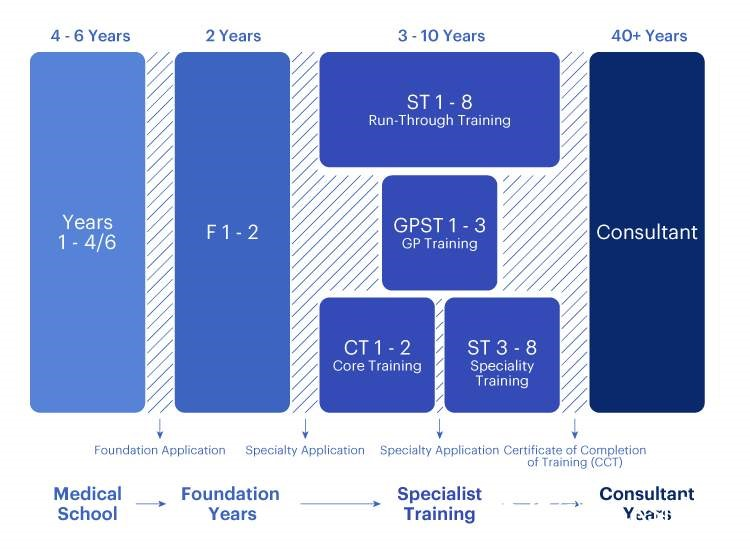

# 3、考过PLAB（UKMLA），完成GMC注册之后——在NHS的第一份工作，GP专科培训以及MSR

> 本文转载自
> https://www.dxy.cn/bbs/newweb/pc/post/50331183

来英国三个月了，生活逐渐安定，也可以跟大家分享一点完成注册之后的体验。

之前的经历详见前面的帖子：
> [01、我的PLAB考试经验 我的PLAB考试经验](./24-0816-01.md)

> [02、通过PLAB考试之后，向GMC申请注册流程经验 通过PLAB考试之后，向GMC申请注册流程经验](./24-0816-02.md)

对于非本土医学教育背景的国际医生来说，拿到GMC full registration后的第一份工作一般是non-training position，具体能做什么根据既往的工作经验而定。

关于具体英国医生的职业规划大家可以参考其他资料，比较复杂，可选的道路也很多，这里简单放个图帮助大家理解（网络图片）：

对于国际医生来说，考完PLAB（UKMLA）之后相当于完成了F1（第二列中间部分），一般不需要重新从F1开始做，并且F1据我所知基本上是面向本土医学生开放申请的。

第一种工作是junior doctors。大多数低年资医生会选择申请non-training positions的工作，而各个NHS trust对于这一类工作的描述不尽相同，叫SHO（Senior House Officer）或者trust-grade，还有叫FY3和clinical fellow的，总之不是很规范，但实际上大多数的junior doctors工作都差不多。这一类职位的主要工作就跟国内住院医师类似，即在病房里管病人、开药、写病历、值班、和高年资医生一起查房等等。这一类non-training positions的特点是无法晋升，第一年做这个工作，下一年如果跟医院续签合同就继续做相同的工作。主要的好处是能赚钱养活自己，另外为自己积累NHS experience方便以后跳槽。一部分医生在这个过程中会积累一些“portfolio”（不太好翻译，大约跟简历类似）用于今后申请training positions给自己加分。也有一些医生目标远大，希望最终进入专科培训ST（specialty training）最终成为专科consultant，这种职位通常竞争激烈，需要在non-training positions工作很多年，积累很多的portfolio，加上严格的考试选拔才有可能进入ST。还有一种职位叫F2 Standalone，也是Junior doctor的职位，我具体没有了解过，欢迎大家补充。

不过现阶段这一类工作竞争非常激烈，因为大量的其他国家医学生毕业就考PLAB，又在英国本土疯狂刷实习（也叫elective或attachment）、拿ALS培训，有的甚至卷到要考过MRCP或者MRCS这种专科考试的一部分才能拿到职位。经常有人在facebook群里说自己投了三四百份简历才拿到面试什么的，总之不是很容易。我两个月投了大约60份简历，拿到了一个免疫科的面试，但是失败了。但也有朋友没投几份就拿到offer的，只能说自己还是不够优秀哈哈。

如果很难申请到NHS之内的junior doctor工作，有少数人会选择去私立医院当住院大夫，有个医疗集团叫NES（不是NHS Education for Scotland，具体是什么缩写我也不知道）的会不定期招人在私立医院干活，但有人说这一类工作有些坑，如果不是走投无路了大概也不至于拿这个工作当跳板。

年资高的医生可以申请做registrar。低年资医生和高年资医生的分水岭一般认为是ST3和ST4之间，也就是说ST4以上一般认为是高年资专科医生了。对于既往临床经验较为丰富的医生，有的可以直接申请non-training registrar的职位（ST4及以上），这一类职位比junior doctors更为专科化，通常年资也更高，主要工作是同专科医生一样，出门诊、会诊、和Consultant一起查房、作为高年资医生值班等等。这一类专科工作经验对于今后进入真正的ST也很有帮助，薪水一般也会高一些。

还有一种路径就是当GP（General Practitioner），也就是全科医生。英国的GP系统是整个NHS极为重要的一部分，作为NHS的门户，主要工作地点是社区诊所，有时候对于一部分难以行动的病人还需要去他们家里看诊。对于需要专科就诊的病人GP可以做转诊（referal）；对于情况危重、紧急的病人可以refer他们去医院的急诊就诊。经过专科或医院住院就诊的病人会被转回到社区由GP继续诊疗。全科医生的工作顾名思义是所有专科，面向的人群也是所有年龄性别，每天遇到的问题也包罗万象，除去内外妇儿，还要涉及到一些皮肤科、眼科、耳鼻喉科、精神科等等内容，听上去也颇具挑战。优点也很明显：培训周期短，培训完成后成为独立GP，可以自主决定工作主要内容和时长，还有机会发展Special Interest出一点专科门诊、从事一些行政或教学工作等等。虽然无法成为白色巨塔顶端的专科大佬，但至少也是一份相对自由的好工作。至于大家普遍关注的work-life balance，可能还是要视具体工作的地区而定。我目前刚刚开始GPST，这里可以多介绍一下如何进入GP专科培训。

关于申请GP的详细内容参见HEE的解释 https://medical.hee.nhs.uk/medical-training-recruitment/medical-specialty-training/general-practice-gp/how-to-apply-for-gp-specialty-training

这里具体说一下CREST表。CREST（Certificate of Readiness to Enter Specialty Training）表就是一个打分表，里面有作为合格F1的各项能力，需要一位在过去3.5年之内和你一同工作的高年资医生（和英国Consultant同级别，国内大约就是主任医师）对你的这些能力进行评价，只有全部合格才有资格申请。这位医生不一定非要是英国本地的医生，但需要提供目前在所在工作地的注册信息（国内对应的就是当地卫健委的注册信息）证明这位医生目前仍持有有效注册，注明职位、职称，提供联系方式以及签名。大家如果能找到过去工作的领导完成这份表格，一般就能够通过申请的审核。当然申请GPST还有一些其他要求，大家可以自己研究网站。

审核通过后就需要参加MSRA考试，一年有两次。关于这个考试的介绍 https://medical.hee.nhs.uk/medical-training-recruitment/medical-specialty-training/multi-specialty-recruitment-assessment-msra

这个考试不止是用于GPST的申请，很多其他专科的ST都会参考这个考试的分数进行排名，选拔分数高的考生进入面试。GPST和Psychiatry ST比较特别，都没有面试，完全依靠考试分数排名发offer。考试分为两个部分，分为Professional Dilemmas Paper（简单讲就是医德医风）和Clinical Problem Solving（临床知识）。这两个部分权重相同，最终评价的标准是两部分都通过最低线+总分排名。申请时要将自己想去的地方进行排序，最终系统会根据考试得分和志愿顺序提供offer。

关于这个考试的复习，临床部分我用了passmedicine的题库，刷了两个多月，最后考了很高的分数，说明这个题库有用。令人尴尬的是这个“医德医风”的部分。我用了facebook上大家推荐的NHS foundation programme样题、Oxford SJT手册和passmedicine的题库，结果也只是低分飘过。考试时时间极为紧张，很多选项模又棱两可，据说是在NHS工作过的人回答起来更容易，总之我没找到特别有效的复习方法，算是运气好飘过了。依仗着临床知识部分的高分，也顺利拿到了自己排在前面的志愿。需要提一句的是，这个考试对于我这种从国内申请的考生来说有一个好处就是，考场是外包给Pearson VUE的，不用非得去英国考，我就是在北京考的，省了很多麻烦。

有机会再介绍一些GPST的具体内容，如有不正确的地方欢迎指正！