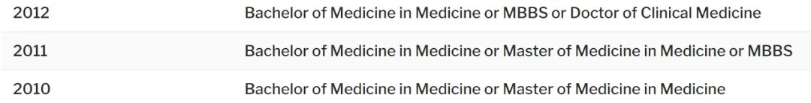
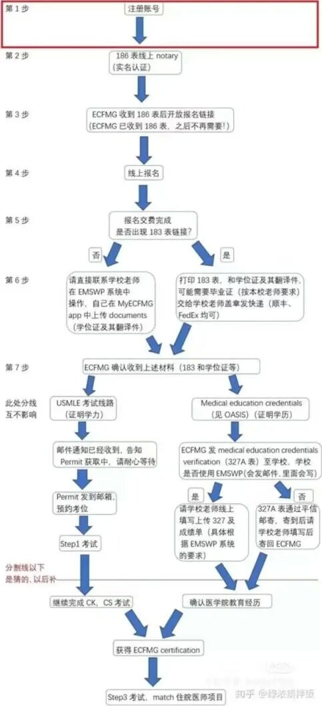

# 1、从医行 | 6个月速通美国执医USMLE-STEP1攻略（上） 

> 本文转载自
> https://mp.weixin.qq.com/s/QI79Q8jbQTE75nIF2a9ZYQ

本系列为全网最全系列专栏。今天，我们将推出本专栏的第8篇系列文章：**美国执医USMLE-STEP1一条龙攻略（上）**。从医行专注于保研和留学，本文与海外执医相关。

本文内容宏大，分为上中下三篇，共计**2.5万**字余，笔者从实际出发，分享了完整的考U攻略和心路历程，为目前国内相对而言最新最全的**USMLE攻略**。

本篇总计**13060**字。

### 讲者介绍
``` 
作者：沉吟学长
专业：儿科学五年制
本科：医科大学
硕士：某院校学硕
其他：无科研、奖学金，国家三级运动员
```


### 前言

USMLE，美国执业医师资格考试。第一次接触到这个词是21年9月，但彼时又面临考研的压力，出于自信不足，又考量到整个流程之困难，最终放弃。

一志愿落榜后，我也如芸芸大众般希望通过申博来逆天改命，但随后慢慢认识到一些事情的真相，也修正了幼稚的想法。

逐渐陷入迷茫，直到23年10月的某一天刷社媒，偶然看到Dr张通过LMCHK到香港行医的帖子，尘封的记忆从此被翻开，野心开始燃烧，牙关松开又咬紧，恨意与不甘再次涌上心头。

用了5天时间，做出这个改变我终生的决定。**轨迹和三年前逐渐重叠，一切都是冥冥之中自有天意。**

**自23年11月初，至24年6月5日，没有周末与节假日，甚至没有春节，生活只有一本FA，一套UW题库**。抛开出门的7场比赛占了些时间，共耗时6个月通关STEP1，在大陆范围内倒也算得上名列前茅。这一切都得益于妈妈的无条件支持，导师的全权放手，与自己那股狠劲。3年前的我，不敢想自己还能通过美国的全英医师考试（第一单元）。

半年多来，感触最深的一点是，绝大多数想考U的，都会因为考研/推免/申博/就业而放弃它。拥有最坚毅的决心，能破釜沉舟断掉自己的退路，才适合踏上这条旅程。

**这是勇敢者的游戏。**

USMLE极大地开阔了我的眼界，丰富了我的知识，它为我打开了一扇崭新世界的大门，它告诉我原来世界上还有这样那般的可能，它使我始终坚信自己的付出能获得300%乃至500%的回报，它让我相信自己会有光明的未来。只要回报足够丰厚，我就从不怕和命运对赌。

困难必然存在，STEP1,2,3，实习，MATCH，每一步都不能出错。但同时，也不需要再考量就业，申博，抑或规培了，都不在乎了，走上这条路，我也不需要在乎。

考后等成绩时，我绞尽脑汁想出一切能想到的信息，并以流畅丝滑的逻辑，通俗易懂的语言加以解释，**耗时3个日夜写出本文初稿，而后2个月内反复进行数十次修订**，对内容作删减和补充。请让我来掏砖引玉，按照以下框架为你简单地介绍它。


### USMLE介绍

#### 一、USMLE是什么？

USMLE，美国医师资格考试，全称The United States Medical Licensing Examination，是 Federation of State Medical Boards（FSMB）和National Board of Medical Examiners（NBME）主办的美国医师执照的三步考试计划，包括Step1，Step2CK，Step3，以下简写为S1，S2/CK，S3。

其目的除了为本国医师提供执业医考试，也会用全世界中产天花板的收入和待遇来招揽世界范围的精英医生前往美国。


*注：上图为Ginger老师所做*

以下是潦草的思维导图，方便理解：


IMG（International Medical Graduate,非美国非加拿大的外国医学毕业生）通过S1，S2+OET+pathway后可获得ECFMG（Educational Commission for Foreign Medical Graduates，美国对外医学教育委员会）颁发的证书。


##### 一、STEP1

是基础医学内容，考察内容包括但不限于病理，组胚，解剖，药理，微生物，免疫，生化，生理，病生，遗传，等学科。考察形式为7个block（7张卷子），每张40题且限时60min内做完，全部单选题，每题里有几个选项是不定的（最少4个，最多七八个甚至10个也都有，但通常给的越多题越简单，反之亦然），考试时间为8:30—16:30，7h考试+1h休息时间，每张都可提前交卷，剩余时间会自动计入休息时间内。

S1与S2/CK可以在中国大陆的北上广州考完。STEP1于2022年改革前显示分数，改革后成绩单上没有分数，只写pass或fail（过了与没过）。为方便理解，贴题目如下。


PS：**实际考试是没有中文的，是全英的医学英语考试**，此处贴上翻译是方便理解。

##### 二、STEP2 CK（Clinical Knowledge）

是临床医学而非基础学科的考试，考察内容包括但不限于诊断，治疗，药物选择，预后，随访。为8个block（8张卷子），小于等于318个题。其余形式和考试地点均同S1。成绩为分数值，300满分。**目前中位数成绩是249，CMG考到240+是正常水准**。竞争越激烈的科室（如皮肤骨外整外）因为竞争者水平更高，对CK的分数要求就越高（均分250+甚至260+）

此外，260看似比250高了10分，整个考试上也就多对了那么几道题，但因为**知识量对正确率的帮助有边际递减效应**，从250到260付出的努力要比230提升到240多的多。当然考试有时也看运气和手感，多种因素兼而有之。

在22年前 S2是分为S2 CK+CS（Clinical Skill）两部分，S2 CS是需要赴美考试，考察内容类似于国内的OSCE，对着SP完成一系列查体和病史采集。现在S2CS已经取消，改为Pathway+OET，此处会在下文进行解释。

##### 三、STEP3

融合STEP1+STEP2，考察内容是临床的全套诊疗流程，考2天，第一天6个block共232题，第二天6个block，共180题。S3满分300，220+是正常水平，但S3本身的分数并不重要，因为考完CK的都能顺利拿下S3，且面试官不会过多在意S3分数（大家都是220+）。需要注意的是S3只能在美国本土考，不像S1 S2都能在大陆考试。

补充内容：

1、考完S1 ，S2CK，和OET就能拿ECFMG证书（美国执医资格证临时版）并参与match（规培面试），step3对于match是充分不必要条件。STEP3要求是在规培期间考完，但不考step3也能去参与match，而绝大部分IMG（国际医学生）为了增加match成功率，都会在实习/见习期间考完S3。且match时考完S3才能拿到H1B签证（比J签更好更方便）

2、22年改革前S1是分数制，满分300，230+是正常水平，改革后取消分数显示，只分pass和fail，意味着只要能pass，后台的满分和刚过及格线都是一视同仁的，pass后成绩单不会显示具体分数，但S1 pass的基准线相当于改革前的192分。

3、理论上本科入学后即可报名USMLE的STEP1或STEP2CK，但部分学校会对报名有限制。举例：和同学求证过，福建医大教务处要求大三结束后才能报名，汕大也有此情况，所以具体情况请联系本校前辈/教务处老师求证。

此外，并不是说一定先考完s1才能报名ck，也可以先考ck再去考s1，但所有人都是选择先1后2，因为先理解基础机制，再做临床诊疗才是正常的思维过程。如果药物的机制，人体解剖都不会，又如何理解临床的诊断，用药？

4、S1虽然当下不显示分数，但ck的分数是与s1的掌握程度高度相关，因而s1的内容也不能完全大意，至少基本疾病的HY（high yield，高频考点）都是需要牢牢掌握的。

5、2022年USMLE改革将S1的分数制改成P/F制，对中国人有何影响？辩证看待，一方面S1没了分数的确是不利好一生都在考试与上岸的中国人，但另一方面，速通S1有利于你进入USMLE的大堂，继续接下来的实习托福签证等事项的处理，快速PASS后也会极大地增强自己的自信心，减轻心理压力。综合来看，S1改革成P/F个人认为是利大于弊。

6、整体来看，S1 2CK 3的考试难度是倒金字塔，难度依次递减，越到后面越相对轻松，S1备考时专英词汇的学习，阅读速度的提高，信心的增强，CK相较于S1题目本身难度的降低，都会使得三者的难度依次递减。

7、pathway是指他国医生对自己的临床能力的一个证明，具体措施包含pathway1到6，也就是6条途径。国人用的是1（通过中国执业医资格证来证明自己临床能力，找中国执医挂靠单位所在省份的卫健委出具证明即可），6（在国内外找带教进行模拟考核并将结果在网站上传 也叫mini-CEX），3（找学校教务处进行OSCE考察，但对毕业年限有一定要求）。Pathway虽然办起来麻烦，但本身是不会卡人的，不必过多担忧。

8、S1，S2CK，S3只要通过就都不能刷分，CK只有一次考试机会，且会显示分数，是三次考试里对于CMG（Chinese medical graduate，中国医学毕业生）最重要的一个考试。但无论如何，三个考试都必须一次性通过，若是fail会在后台留记录，match时候有极大不利。

9、USMLE每场考试的最大考试次数是4次。比如S1，连考4次都没通过S1，就没有资格继续考试。客观来说，毕竟S1的pass仅相当于改革前的192分，在满分300的考试，别人都考230+甚至240+，自己如果连192分都没过，应该考虑自己是否真的适合赴美行医，及时放弃未必不失为一种好选择。且就我个人角度，身边或国内社媒上都没见过S1能fail的（不排除幸存者偏差，但reddit网站上倒是有不少印巴同志说自己S1 fail了）。

10、规培年限为3-7年，具体看match什么科室，内科IM（internal medicine），儿科，家庭医学FM（family medicine）都是3年，最长的神外心外可达7年（但就职后收入也极高）。

11、USMLE官方并不公布判分标准，意味着S1的280题，S2CK的320题都是300分满分，但考生并不清楚每道题的分值如何，试卷上也不会标明题目的分值。有民间传言，说题目里面有一部分是实验题，不计入最后分值，但这并没有官方证实，在此写出，仅供参考。

### 二、赴美VS国内行医的优劣对比

.jpg)


对于赴美行医的利弊，以上种种**仅是我个人的浅薄之见**，仅供诸位参考。

于我个人而言，为什么赴美？原因除了上述几条，我自己的看法补充如下：

1、我要让家人过上最好的物质生活，买什么都不必考虑价格，想去哪里只要和我一提，我就可以立刻预定最舒适的机票酒店。我一定要给她最好的，只有在发达国家行医才能满足这样的薪水。
   
2、美国医生可以和医院谈条件，选择不上夜班。这对我的个人生活极其重要考研时我就坚持“没有夜班的科室就是好科室”的原则，并贯彻始终。规培或住院医期间会有夜班，24h on-call也很苦，但熬几年后会有很大改善。且说实在的，在US做规培，他们的待遇每年税后5-7w刀能落实到位（有工会给你撑腰），自给自足不向家里要钱绝对没问题。对比国内读研/读博/规培出力又没钱的情况，云泥之别。

3、US可以哪里缺医生就去哪执业，跳槽相对国内更容易。飞地医生或locum（代理医生，公司来办执照，自己选择一个月上几天班）很有趣/轻松，对我非常有吸引力，我喜欢这种不受束缚，自由自在的感觉。

4、发达国家体育氛围远超国内，对想从路跑马拉松/越野赛，进一步转战铁人三项/公路车赛事的我来说极富吸引力，而铁三，公路这种烧钱又烧精力的项目，在国内普通医生承担起来，至少在前期还是有一定压力的。

5、接触USMLE后才知道医学教育有多少的，美国的医学考试对比国内的期末考+考研+执业医，是激光剑暴打原始人。几乎每个题都让你感叹知识考察的灵活性以及考试本身是可以多么的贴近临床。此外，共识指南都是“翻译”的，科研思路也都是“借鉴”，老生常谈的东西不提也罢。

6、报考U后，通过社媒联系到了本科直系师兄，他在七年制博士阶段和US联培，18年match到芝加哥某医院规培。和他微信电话时，他操着一口流利的英语和身边的人打招呼，内心的艳羡更加坚定了我的想法。既然羡慕，就去成为这样的人。至少在考试这方面，师兄能做到的，我也必然能做到。无论如何，请相信自己能行。

7、极其厌恶国内的社会关系。虽然说有人的地方就有江湖，但欧美的关系并不会像这样绝对和畸形（申博就业时，有时是关系大过天）。我不想低三下四卑微求人。我不要找关系，我就是关系！

### 三、什么人适合考USMLE？
 
1、意志坚定，行动力强的人

每每有人和我交流，我总会反复强调意志坚定的重要性，不论是在我心中，亦或是实际情况，**坚决的意志都是永远的No.1**。这条路从开始准备U，到最后卖上，少则2年，多则4-5年。赴美行医也远不止USMLE这3次考试，还要准备诸多杂事，包括但不限于申实习，办签证，OET，托福，申请pathway等等，考试本身其实是最简单的事情，实习和match遇到的困难远比考试多。没有足够的决心只会陷入无边无际的内耗和犹豫。我见过无数嘴上说着想考U，实际不停给自己找理由拖延，压根没有任何行动的人。请务必不要让自己成为其他人口中的小丑。

2、不给自己留退路的人

看到这里可能会有些许困惑，在中国人的认知里，凡事都要给自己留个退路不是吗？但至少在我看来，**考U是一条极致的单行道，考U意味着要放弃相当多的选择**。

一位老八所专硕毕业，目前在长沙工作的姐姐和我聊，她不满意私立的性价比，递交了辞职信。目前在考U和申phD之间摇摆不定。她自己其实并不喜欢科研，去读phD也不开心，只不过想给自己留个后路，怕U最后没卖上，也好有个保底。但也坦然自己已经27岁 并且有娃了，再读4年博然后去卖实在耗不起。这样反反复复从2022年就开始纠结和内耗。打电话是希望从我这里能获得一些鼓励和勇气。她说羡慕我的心无旁骛，殊不知其实是自己当断不断，反受其乱。

我在23年11月初还和一位陆本直博 US phD的老哥聊天，那时他说把手上的文章搞完就开始考U，24年6月我考完S1后再问他近况如何，他和我说在写文章,投文章，“搞琐碎的事”。这样的情况见过不下几十例了，实在是不胜枚举，不再一一赘述。

“季文子三思而后行。子闻之曰：再，斯可矣”

季文子三思而后行，孔子听说后，评论道：**“想两次就够了”**

3、能获得家庭100%支持的人

无须过多解释，没有家庭支持，在校生或刚毕业的学生是不可能掏得出考试费，实习费的。而且在漫长的备考过程中，家庭的鼓励与劝慰永远使人踏实安心。当然，若家庭条件实在困难，可以在读书期间先考完考试（有效期7年），在规培/工作时攒钱继续后面的事情。有一位同学便是如此操作，研三备考STEP，打算工作几年就去实习。

4、沉得下心，能坐得住的人

对本科生而言，S1+CK耗时约1+1=2年（大陆本科生期末临时抱佛脚的知识基础不够牢靠，应付U是远远不够的）。期间要尽可能放下娱乐玩耍的心态—旅行，逛街，玩乐都和你再无干系，你的内心只有题目和课本，每天想的都是什么时候能把这一学科的题目刷干净，UWorld（USMLE考试练习的一个题库）的题目正确率有多少。

就我个人而言，有考研的底子，早8晚10.5，无双休无节假日，脱产6个月考完，这个速度放在全大陆的CMG也基本是极速。绝大多数CMG是10到15个月考完S1（当然这其实也是因为他们走了不少弯路，而我底子尚可+没走弯路），请务必厘清自己的毅力，耐心。毕竟考研初试也不过耗时9个月附近，而对绝大部分人来说，U的1,2,3加起来至少也要15个月（对本科生而言即使能在大五毕业前考完S2CK，都是快到令人发指），还需要和各种变态的词根词缀，以及杂事做斗争。做好心理准备。**这条路非常非常考验耐性。**

5、思维灵活，懂得变通的人

此处的思维是指搜集整合信息能力强，**对事情能有自己的观点与态度，知道要用何种方法最快最高效地达成自己的何种目的。**处理各种杂事的问题，比如：

签证什么时候办？怎么办？要不要找中介？

见习/实习有成百上千的项目供你筛选，应该选择哪些医院与科室？如何与PD（program director）沟通？项目要求打什么疫苗，在哪打，买什么保险，在哪买？哪些项目性价比最高？住宿电话卡机票酒店饮食又如何解决？

考试课本用哪些？视频看什么？买哪些题库？模拟题用什么作参考？有哪些小工具可以提高效率？有什么网站和论坛值得收藏？

我应该在哪些时间节点完成什么任务？任务的先后缓急如何规划？最重要的是——我需要如何搜集这些信息并保证它们的可靠性？

以上只是浅显的几个例子，在USMLE成功match前的所有步骤里，考试本身其实是最简单最可控的过程，真正困难的是安排实习和处理琐事，规划时间线，match的项目筛选，报名以及面试表现，这些事情才是考验一个人综合能力的关键时刻。

**请确认你拥有不厌其烦的耐心，坚信自己可以过五关斩六将的韧性，执着，以及游刃有余处理各项事宜的能力。**

6、不会轻易后悔的人

**USMLE是单行道，是一场豪赌**，它的沉没成本越来越高昂，在卖（match，指规培面试成功）上之前，每一步的投入都会累积起来，直到放榜日转化为一切回报。

时间2到5年，全套投入20-30w RMB，放弃安逸的生活，踏入荆棘密布的未知。

理论上，如果没卖上，第二第三年可以继续卖，但这需要你提升自己的竞争力，否则也大概率是重复第一年的结局。且第一年没卖上也会极大地打击自信心，怀疑自己的投入到底值不值得。在放榜日揭晓前的每一步都不能回头，贪生怕死，恐惧失败者请莫入此门。

就我个人而言，我始终相信赴美的性价比是高于国内的，举个例子，国内是投入8分，回报6分。那么US行医则是投入20分，回报50分。超高风险对应的必然是超高回报，反之亦然。但U的回报必然远超过你的付出——我对此深信不疑。不然为什么越是名校生越对U趋之若鹜？老八所的八年制里考U的比例甚至能达到5%-10%，他们都是最精致最功利的利己主义者，因而我也相信他们，和我的判断。

### 四、考U的专业or院校限制？

截止目前（24年8月），ECFMG认证中国绝大多数高校，甚至有些二本三本的临床医学都能考。

目录在ECFMG官网可查：https://www.ecfmg.org/resources/reference-guide.php

目前绝大多数情况是只认本科五年制临床大类，若查询结果含master（且毕业年份和graduation year吻合），则表明硕士若在此学校毕业也可用硕士学位报名，博士（Doctor of Clinical Medicine）同理。但以硕博学位报名的情况目前日渐稀少，可在此略过不谈。

何况，在2021-2024之间ECFMG会卡本科二级学科的不许报名，就有人用硕士跨考到临床，且硕士院校符合报名要求的硕士学位证来报名U，以此“作弊”，来跳过本科专业的限制，举个真实案例，之前有人本科预防五年制，于2012年前硕士毕业于湘雅临床，当时湘雅的master of medicine也正位于Credentials列表，他就用湘雅硕士学位证报了U，且当时尚未发生“科硕门”事件，跨专业后也能拿中国执医。但现在既然本科二级学科也开放了U的报名，那又有什么必要非得用硕博的学位来进行报名呢？

非要说的话，我也只能想到一种情况：本科四年制医技/护理，录取临床学硕/学博，且毕业年限，master of medicine/Doctor of Clinical Medicine或都与目录吻合（比如浙大的master，华西的MD），于是就能以硕士/博士学位证报考USMLE美国执医（尽管因为本科是四年制，考不了中国执医）。

这在理论上似乎是可行的？但迄今为止还没见到过身边有新毕业生走这种情况。

本科四年制的同学尽管也有不少人考了临床学硕/学博1002，且自己也希望脱坑，但估计也压根不会异想天开还有这种搞法。


 
补充：

1、“科硕门”请自行搜索，在此不做解释。

2、MBBS为六年制，是国内院校对外国人开放的学制，与大陆本土医学生无关。

3、之前在丁香园刷到过帖子，有人大陆本科四年制医技，通过申诉报名了日本执业医资格考试。可能很多事情还是事在人为吧。

4、国内的4+4据说是不被认可的，也就是说即使拿了MD学位也报不了USMLE（此处存疑）。

5、USMLE-STEP1的账户注册是1k人民币附近，报名考试是1195刀，但如果报名失败是可以退费的（尽管确实麻烦），因而如若真的有本科非临床大类，硕or博录取了目录里硕/博学位符合报考要求的院校（举例：影像技术四年制本科，录取华西影像专业1002学博，或浙大1002学硕），可以考虑尝试注册报名试试，如果第一次被拒就发邮件argue，毕竟大不了就损失账户费1千元，报名费就去申请退费嘛。

若是本科五年制直接报名，专业目前仅限临床医学，儿科学，医学影像学，眼视光医学，精神医学，麻醉学，放射医学，这7个五年制临床大类专业报考。

一切四年制，和五年制非临床大类（如临床药学）以本科学位（Bachelor）均不能报U。
若是非临床的二级学科本（麻醉等专业），建议去小红书搜索Ginger的帖子，小红书号42159908362。Ginger老师的讲解足够详细，我也不多在此赘述。

补充：YOG是year of gap的缩写，意为离本科毕业年限。如22年五年制本科毕业，那么25年则是3年YOG。YOG是match时美方会参考的重要依据，他们认为YOG越长，脱离临床的时间越久。

**YOG越短越好，小于3是最佳，5以内能接受，大于5是劣势，10+是大劣势。**

但是，如果你有足够的科研文章，或能用合理的理由解释此YOG（如专硕YOG毕业时虽然是3，但在临床干了3年，那理论上也可以说服他们，当然这个事情要看人）

国内的学制千奇百怪。5+3本硕连读，正统八年制本博（教育部钦定的14所八年制院校），部分高校开设的伪八年制本博/本硕博（首医的阶平班，中国医的红医班，南京医的九年制天元班），种种学制很难做到统一。而实习或 match时各个program或PD对此的态度也不一而足，需要具体情况具体分析，随着PD对国内套路的逐渐熟悉，建议长学制也以YOG是第五年而非第八/九年开始计算。

具体的报名限制可参考ECFMG官网的要求，网站如下：https://www.ecfmg.org/certification/

### 五、考U的开销？

相信这是同学最关心的问题之一。一言以蔽之，全套是20-30w人民币费用。

**最大头：在US给医院交的实习费和生活费**，通常情况下，大学医院项目的费用比商业实习高昂，但质量也更高，主治医的人脉更广地位更高，拿到的LOR（Letter of recommendation，推荐信）的效力越高，学到的东西更多。一个正常费用开支，大概是4周实习费2k-3k刀（仅为实习费，不含生活费等）。

我见过最贵的有6周1万刀实习费的JHU（霍普金斯），最便宜的也有KUMC（堪萨斯大学，50刀申请费），CCF（克利夫兰诊所，申请费500刀）等只要能申上基本不要钱的项目（申请费交了不代表必然能申请成功，PC program coordinator要看CV简历进行筛选和面试！）

match申请项目也要交钱，一个项目30刀附近，申请越多拿到面试的几率就越大（申请数量通常是100-200个）

这俩大头也是弹性支出，**丰俭由人**，越阔绰越好。

杂七杂八的开销：USMLE考试的S1 2 3报名费共3.5-4k刀和签证往返的路费住宿费，疫苗费保险费，电话卡费用。签证费。托福2k人民币，OET的587澳元考试费。

题库：省的话可以像我一样压缩到极致，题库买二手（S1的二手UW，6个月900元，CK是6个月1.3k元），或者白嫖，NBME模拟卷用PDF版本。

如果只开全新UW（U路上最重要的Qbank）的话，就是500刀*3=1500刀，考得快还能把题库卖了回血。

补充：

1、20w-30w的开销不是一次性支付，在开始准备实习前的开销其实都很少！！报名S1,CK，这俩整套也就3k刀附近（不过依然是我已知的最贵的考试）。实习后才是大头开销，实习前都是毛毛雨（当然我这并不是鼓励你来报着考一下去试水）。

2、卖上residency住院医后，税后1年收入是5-7w，即使考虑到日常开销，理论上也是只需要1年甚至半年就能把所有的投入全部收回（美元兑RMB）。

### 六、全职or兼职？

对本科生而言，取舍在于要不要放弃科研/大创/奖学金/考研等；对硕博，取舍在于放弃科研/申博/就业；对在职者，取舍在于放弃工作/晋升。

全职时间多，纷扰少，但诸多放弃需要很大决心并付出机会成本。

兼职缺点则是要从夹缝里面挤时间，很难保证学习的质量和数量。这要求你多线程工作，把生活安排的井井有条，成为一名时间管理大师。

就我个人看法，我身边的已毕业的U友大部分是兼职，如phD在读，硕博在读等。但对应的，他们的备考时间往往非常漫长（单考S1就是12个月起步），且曲折（会和工作产生冲突，或面对同事的阴阳等）。

因而我个人的建议是，**先兼职学U刷题 1-2个月，并通过社媒逐步摸清USMLE的底细，了解基本脉络，确定自己到底适不适合U。**如果不适合就立刻放弃，不要回头。如果依然坚定，就脱产/放弃其他事宜，全力攻U

理由如下：

1、U本身的医学英语是个不小的挑战，CMG想应付它是要喝一壶的。考试形式灵活精妙，与国内的传承20年的包浆题目迥然不同，适应也需要时间。你确定自己能兼顾两头甚至三头吗？

对本科生而言，奖学金保研考U科研大创我全都要，这是不现实的。人的精力是有限的，什么都要往往适得其反

2、U只要成功了，回报就是300%甚至500%，相比之下，国内的一切奖励（各方面的，荣誉、收入等）都像是过家家，即使是录取了协北复交，与成功match相比，也统统不值一提。

3、你喜欢科研吗？喜欢大创吗？我相信绝大部分医学生入学都是为了做医生，那么你愿意为了做医生而委曲求全去制造一堆无用且恶心自己的学术垃圾吗？愿意用几个月的时间去糊弄出一个精美的PPT去参加大创忽悠评委吗？愿意每天跑代码学R，SPSS吗？愿意用这些无实际意义的垃圾来感动自己吗？

去他M的，我不愿意。我只想当一名纯粹的医生，我不喜欢这些，所以统统给我滚。**我只做自己觉得对的，顺心意的事情。**任何违背我本心的事情我碰一下都觉得恶心。

### 七、考U的人群画像？

1、在整体IMG里，印巴加中是最多的，也有日韩，东亚（马来，柬埔寨），港澳台等世界各地的医生去考，**CMG成功match人数为70-150人浮动，match成功率是60%-65%**。有绿卡，CK高分，YOG短，不挑规培项目去社区医院or差科室也能接受的，paper优秀，LOR质量高，这些都是帮助你match的重要因素。其实录取率说是60-65，落到每个人头上就只有0或100的区别。

目前大陆内已PASS S1的应该有1k人附近?（数字为ChatGPT估算，无实际数据支持），越往后的人越少，因为有相当一部分人考过S1后就不继续考了（比如汕大）或放弃，也有部分医生出国进修需要S1成绩（丁香园刷过有人说去mayo进修需要STEP1 PASS）。到match时每年也就二百来号人，最后录取规培就是这二百多人的60%-65%。

另：备考时相当一部分人都是雷声大雨点小，有个U的备考群，备考S1的有3个分群，加一起估计有个1200人，CK分群只有可怜的70人（进CK分群需要实名的S1成绩单）


2、CMG里，每年通过USMLE-STEP1约为500-600人，临床大类每年毕业为20-30万人毕业，相当于通过USMLE Step 1的人数约占临床医学大类毕业人数的0.2%到0.3%，**基本上1k个医学生里有1个考U的**（此段数据来源于GPT回答），院校层次越高这个比例就越高。92高校+首医+汕大（汕头大学医学院情况较为特殊）是考U的主力军。

实习的群里，备注基本都是92高校（多是92本科，而非92硕博，两者有本质区别），协北复交考U比例估计能有个10%？这个不好说。但可以肯定的是，在省市医科大学还在苦哈哈地宣扬考研考公时，相当比例的名校生都在悄无声息但又坚定不移地践行临床润学了。

刚进实习群时给我的震撼是极强的，自己本科院校在全国也算是有头有脸，群里却属于垫底水平，不得不感慨真的是选择大于努力，而选择又是由眼界与身边环境，信息来影响的。

1、整体上看，越是92名校考U的比例越高，省市级医科大本科所有人加起来也不过3-5人，复旦一个年级我知道的至少就能有5人，何况他们本科招生人数又极少。

2、从我身边来看，简单举几个例子：

小A：南京医5+3，23年10月开始备考S1，预计24年9月研一入学后开考S1  
小B：湘雅本硕麻醉，摇摆2年后，于24年7月all in考U  
小C：北医影像本 US phD在读，已考完S1，正备考CK  
小D：山东311儿科学大四，大三考完S1，正准备休学实习+CK  
小E：重医临床五年制大四，刚考完S1，目前准备托福+实习,CK  
小F：我的本科师姐，协和专硕，本科考完S1，研二考完CK，研三毕业后去US实习并参与当年match  
小G：协和心内博在读，23年11月考完S1  
小H：华西硕上二医博在读，24年1月考完S1  
小I：上医八年制，无paper无绿卡无connection，依靠个人能力和短YOG，24年3月match普外科prelim

以上我只是好友圈里的冰山一角，实际走这条路的大佬云集，卧虎藏龙，简短的表述也仅供各位参考。

### 八、报名流程及细节


*（上图为绿浓痰拌饭前辈的图）*

USMLE STEP1的大致报名流程如上。开USMLE账户费用135刀，STEP1报名费1195刀，必须是境外信用卡，不接受银联（我办的中国银行的visa）。186表就是交完报名费后弹出来的一个PDF确认书，存好确认书后去notarycam网站预约和老外的在线视频认证（防止替考舞弊），认证时需要带护照。

Notarycam是一个公证网站，预约有3种方式，1是在线排队匹配预约，2是在网站选个时间点预约（https://calendly.com/notarycam-cal/schedule-notary?month=2024-08 ），3是发邮件给ecfmg@notarycam.com，和他说我现在报名了考试需要紧急预约，请给我加速办理。

**个人建议是依次尝试，方便程度123依次递减**。2如果日历排的很满或者贼着急就用3。

在校生和毕业生报名流程有区别，前者不是很清楚，后者需要学位证+成绩单（transcript）的中文原件+英文件。成绩单英文件我用教务处开的直接传就过了。学位证是淘宝找个翻译公司10元搞定然后提交上的（真心没必要用USMLE官方推荐的straker，贵到起飞）。

另：5+3或八/九年制的学位证得具体情况具体分析，每个学校都不同。

Notarycam认证结束后，ECFMG会发邮件给学校教务处（也会给你邮件提醒），马上给教务处负责这些的老师打电话请他们处理（我校是当天上午就弄完了，但不少学校会墨迹几周甚至几个月），目前学校材料绝大部分是电子处理，听说极少数是邮寄纸质版给ECFMG官方，这些可以提前和本校前辈/负责老师打听清楚。

EC收到材料并确认后会给你发permit（准考证），带着准考证去prometric（全球最大的考试机构）去预约考期（几月几日）和考位（北上广）。

在最初报名时要选3个月时间段，如2025年8月1日——2025年10月31日，预约考位时只能从这3个月里面选具体的日期去考（周六日也可考）。且如果想延期考试，来回折腾很麻烦，还得交手续费。所以，要么报名时就选好大致日期给自己一个ddl且后面不轻易改变，要么就先复习等准备好了再报名，个人更喜欢前者，因为有压力才有动力。

在刚开始报名选3个月时间段时，想约第二年的考试，似乎得在头一年8月以后才开放，比如我想约2026的2月，在2025年5月是约不了的，得8月以后，他们日历更新了，才能选（此处大概率没问题，但存疑）

Notarycam和老外视频连线时，口语听力和基本常识得合格，我连线是位黑人女，问我zip code，SSN，给我弄懵了，后面找同学问了才知道是邮政编码和社会安全码（social security number）的意思。

认证很快，十几分钟就搞定了，对着摄像头举起来护照，拍个照片，弄个电子签名，他帮你宣誓，然后自己“I confirm it”就OK了。

以下是我自己报名的时间节点，供诸位参考。


### 九、考U如何进行信息搜集


另单独说明：Discord（https://discord.com/ ）

是一个APP/网站，需要科学上网，**其中扫盲贴尤其推荐**，是STEP1备考的讨论组，也会做出各个板块来执行不同功能，即使是加社区前的消息也可以直接回看。非常建议找CMG Discord管理员（XHS号622262170）加一下，前辈在US麻醉科规培，时间繁忙，且有时差！**联系时请务必简洁地说明来意，且态度尊敬诚恳！**

本质上来说，**信息搜集是一个很大的话题，也是一门艺术**。信息搜集并不局限于U，在考研/公/硕博/就业时也能体现出它的价值和魅力，此处若是发散讲解，甚至可以单开一项4-5h的讲座，写出上万字的内容，故而在此不多做讲解。

### 十、签证Visa

一言以蔽之，**对大部分医学生而言，是用B1/B2旅游签去US实习，match时选H1B或J1签证**。博后/留学的大佬另说。

1、H1B签证是US给特殊专业人才的工签赞助H1B签证，J1是学者签。H1B的质量远高于J1签。但目前赞助H1B项目的数量远小于J1（后者数量是前者的3-4倍）且竞争十分激烈。

2、要拿到H1B，必须考完STEP3（备考时间不长，多为3-6个月，通常分数不做要求，210+，220+即可），理论上，在9-10月开始报名match项目时可以不考，先发邮件和项目说我后面会考，在次年1月之前考完也行（考完后发邮件通知项目组）。

**但是！10月医院开始筛人面试时就会对人进行筛选**（因为申请者太多），比如：设置个门槛看CK是否230 240，有没有绿卡，YOG多久，以及是否考完S3，此时若没考完S3，可能就连面试都进不去。所以务必留好时间，在9，10月报名之前就考完S3，别给项目PD去送麻烦！与人方便才能自己方便。

3、以下均为Ginger老师原话：“如果博后能保证给你H，那无妨可以现在申请NIW。如果只能J，最好等来了美国再file NIW I-140，可以提前把材料准备好。NIW现在的功能也就是提早拿到PD，NIW 排队时间太长。”

“J签证可以self sponsor，但是H签必须要给工资。J入境后每次续签只要续签DS2019表格就行了，通常在高校签证内部就解决了，但是H签证续签每次要一堆材料发给USCIS审核。给H还需要单位给打广告两周，即便是non cap H1B。还有有的医院/高校不让PI第一次就给H，必须要先给J，用满5年才能转H，还有有的单位强制self sponsor只能第一年，以后强制PI按照NIH标准发工资，不能给工资只能离职。总之对用人单位来说，J是省时省事省钱。具体细节情况，每个高校可能自己又自己的policies。”

“J physician 和J research scholar 略有不同，J research除了印度，大部分国家的政府都给no subject letter，但是J physician，理论上都需要经过under service area服务两年或者回国服务两年”。

“J physician不能仅仅通过申请waive，但是可以通过去一些相对缺少医疗资源的美国地区服务两年来waive。区别是两种签证从住院医/clinical fellowship毕业后，选择就业的范围有区别，工资应该区别不大，有的缺少医疗资源的地方可能工资更高。”

4、总的来说，J签需要回国工作2年，所以就必须wave掉它，Wei yixiao前辈说这个时间点很难把握。格里高尔前辈说“不要碰J，会变得不幸” 。But，只要能过去，肯熬下来都能熬到身份。

5、MATCH时也有不少项目是不提供任何签证的，此时绿卡就有极大优势。

6、眼界和环境，进程所限，目前我对签证也仅仅是一知半解。在此不多献丑，可自行去GPT，xhs，哔哩哔哩，discord等平台查询资料哈~

7、match的项目提供什么签证，其中CMG比例多少，项目有什么特殊要求（YOG，CK分数），这些都可以在FREIDA官网（https://freida.ama-assn.org/ ）上或者去谷歌项目官网，自行查询。

但很重要的一点是，visa和match的情况，这都是PASS S1后才需要考量的，前期无须，也不应该过多考虑！有个基本感知，清楚大方向已经足够了。

8、另，我咨询了一位在美深耕多年的前辈，以获得更多visa内容，下述内容仅针对高龄（长YOG）想通过科研先拿绿卡后match的大佬，并不适用于fresh（年轻医学生）。

对拿J- research的朋友来说，如果有计划在J上申绿卡，需要注意以下几点：

（1）J- research的上限是5年，最理想的情况下是program 一次把5年的J都以DS2019 form的形式给到你，这样你可以放心的申请waiver；

（2）若没有一次性拿到5年，比如有些program是每年做2019 form extension，这种情况下去申请waiver是影响下一年对2019表的extension，对维持J签不利。当然签证政策与时俱进，但是在申请waiver，递交140之前一定要考虑全面，必要时咨询移民律师。

（3）能直接拿到H当然更理想，但如果需要迂回战术解决绿卡问题的话，J是相对容易获得的签证类型。

9、通常来说，B1/B2旅游签多是在申请了实习（elective），见习（observership）后，PC会给你发邀请函，带着邀请函去大使馆办签证。但签证这个事情得具体情况具体分析，比如，如果你现在仍在校，但马上就毕业了，失去了学生这个下签极为有利的因素，就可以考虑提前先办理（签证尽量在本/硕/博毕业前办理好，学生身份对下签极为有利，因为学生是最不容易黑下来的）。

签证官给不给你下签的核心只有2个：你去美国干什么？你去了以后还能不能回国？**一切因素都围绕这2个问题解决即可。请务必抓住本质看问题。**


注：

1、上图为Ginger老师对J1 physician visa和H1B visa的match项目的比较（2024年8月做，n=584意为内科的H1B+J1一共有584个match项目，其余同理），毕竟CMG去的第一多是IM内科，第二是pathology病理科，二者共同断崖式领先其余科室；

2、其中I-140，I-485等名词请自行咨询ChatGPT，与主线剧情无关，且极费口舌，在此不做解释。
