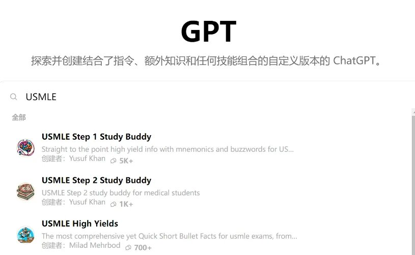

# 2、从医行 | 6个月速通美国执医USMLE-STEP1攻略（中） 

> 本文转载自
> https://mp.weixin.qq.com/s/OQvBhDdyqL3OWeW4qCMLqQ

本系列为全网最全系列专栏。今天，我们将推出本专栏的第8篇系列文章：**美国执医USMLE-STEP1一条龙攻略（中）**。从医行专注于保研和留学，本文与海外执医相关。

本文内容宏大，分为上中下三篇，共计**2.5万**字余，笔者从实际出发，分享了完整的考U攻略和心路历程，为目前国内相对而言最新最全的**USMLE攻略**。

关于本文，**作者开篇声明如下**：本文绝大部分经历为笔者自己的观点和经历，糅合以各大论坛，包括但不限于“mitbbs微信群，reddit，discord，小红书平台 北美华医联盟”的所见所得，著作而成。其中得到了包括但不限于wei yixiao，lydia，fufuchigua，ginger老师，kai姐等各位前辈，pddd，nick，考u羊等同伴的建议与指点，在此感谢以上所述，及其他帮助过考u人的所有人。文章数据尽可能标注出处来源，但内容主观性较强，在此声明。另：本文内容不用于任何盈利。

本篇总计**9462**字。

### 用过的材料

课本：USMLE STEP1 First Aid（不是First Aid Q&A） ，下文简称为FA。淘宝拼多多有卖，每年更新一版，目前最新是2024。

视频：Pathoma视频，看了部分Board and Beyond（简称bnb），sketchy微生物。

题库：Amboss，UWorld（简称UW），bootcamp，robbins，BRS。

补充材料：MEHLMAN arrow+risk factor+人文沟通。

FA：

**打分5/5。课本只用FA就足够，FA就是U里面的圣经**，其知识点的简洁精妙对比大陆研究生编写，大佬只负责挂名的，史一样的教科书，简直是天壤之别。缺点是排版一般，有的页面会显得拥挤，不适合做笔记。

S1过程中其余一切课本都是垃圾，都是LY（Low-Yield，高投入低产出）。我个人倾向于买纸质版，喜欢用PDF也OK。做题or看视频遇到某个知识点就去FA上做笔记或翻知识点。

视频：

**Pathoma：打分4/5，专门的病理视频，病理又在S1里占据半壁江山**。可看可不看，网上都吹pathoma多么无敌，个人看完感觉也不过就是本科病理的内容重复了一遍，仅此而已。如果零基础去找pathoma看，视频里会把疾病给你串起来讲，但后面做题时会发现视频的内容全都忘光了。而且视频和FA的章节不是一一对应关系。当然如果时间充裕看看也是可以的，毕竟就十几个视频，开1、5倍速三五天就能看完。

**Bnb：打分4/5，我只看了药理+微生物部分。但确实是不错的一款入门视频。**条理和逻辑清晰，S1的每个学科基本都有讲解，疾病谱也基本和FA重叠，且语速适中发音清晰，开1.5倍速毫无压力。我个人是比较推荐的。

Sketchy：打分0/5，很多人推荐拿来看微生物的，是图片的抽象记忆法。但我个人很不推荐，因为很多谐音梗和口诀中国人没办法理解，理解了也记不住，记住了在考试上你想用的熟练也非常麻烦。而且微生物本身就是LY（Low Yield，高投入低产出），所以个人感觉这视频意义不大。感兴趣可以去试试。

其余我听说过口碑比较好但自己没用过的视频：dirty medicine，kaplan，pixorize，osmosis，Gojian，可自行搜索和鉴别。

题库：

Amboss：打分3.5/5。不科学上网就能用挺方便（但你都考U了总得科学上网吧），页面UI舒适，贴图美观度甩UW十条街，可以一直白嫖，但相比于UW是考察应用知识的能力，AMBOSS的考察更贴近于死记硬背，里面的题目难度分为1锤子到5锤子，3锤及以上就做着会觉得很难。

**个人建议是1-2锤子的题（题库可以进行难度筛选）拿来做做还是可以的**。整体是不如UW，题目的问法很偏很怪，但依然有可取之处。之前看外网盛赞它是UW之下第一QB，也的确是有两把刷子的。有网页版，不知道有无APP。

此外它还有个好处就是，你如果想看看USMLE的考题都是啥样的，amboss会给你5天free，里面的资料库也能看，而隔壁UW就不会给这种试用 必须得花钱买了才能用。

Bootcamp：打分3.5/5，用过两周多。注册后会给3d free，里面有配套的视频，看完视频会有课后题，也有自己的QBank。当时用了几周感觉课后题太水了，就一行两行的提问实在是糊弄人，就将其抛弃。而且视频里老师口音都太重，听着费劲，讲的知识点还很发散。页面UI和真实考试并不类似。有网页版，不知道有无APP。总之，你拿来做它的Qbank可以，用里面带的AI可以，视频不建议看，视频后的课后题质量也不行。可开，性价比也还算过得去，仅此而已。

UWorld：打分4.5/5。但凡是考U的，没有敢不开UW的人。550刀（团购优惠后509刀）1年的qbank+3个UWSA（self-assessment自测模拟卷），S1的题库共3600题。题目极尽机巧之能事，解析也写的很全。**所有付费题库里，UW的考点和real deal（实际考试）重合度最高。**页面UI+字体和正式考试页面极为类似，还可以调背景色，扣的0.5分是图片不够美观+没有试用+翻墙才能用，但需要翻墙并不是它的问题。除了贵没一点毛病，但贵也并不是它的问题，是我的问题，UW的质量绝对配得上这个价格。

我一朋友S1备考开了很久的bootcamp，和我说boot其实也挺好，开了UW直骂“我X，UW真的牛逼”。是 USMLE路上所有人公认的唯一真神。越早开UW越好，如果你能一开始开UW，那就是性价比最高，最快，最简洁（也最累）的方法（没有之一）。

IMD：巴基斯坦哥们做的一个盗版APP，IOS store和网页版都有，可以google到官网，是同学推荐过的，但我本人没开，40刀1年，含S1 CK S3的UW题库，据说甚至支持支付宝。囊中羞涩（不想多花钱）又收不到二手UW+急需qbank可以考虑这个。

Robbins：打分0/5，是一本病理习题册，买回来做了1周，纯浪费时间。这玩意更倾向于是给病理科专科医师做的，里面很多内容FA没有，S1也不考。而且章节排序和FA也不匹配。实际的考试里病理题目也不会像它这么难。别碰就完事了。

BRS：打分1/5，BRS是一整套的工具书，BRS生理我做了半天就给它扔了。犯的问题和刚才的robbins一样，这玩意可以拿来学习但不适合应试。性价比极低，非常不推荐。

**NBME：打分4/5，是USMLE官方出的训练模拟题，60刀一套，目前官网上架的是26-31,每套60刀，但更建议用PDF**。每套题4个block（4张卷子，每张50题）共200题，题干极短，内容极难。一般是做完UW后刷它，real deal会有原图甚至原题（原题极少，原图会有5-10个）。比如NBME题目里的答案是A，考试会考B选项。求稳的话，NB26-31必做，每个选项解析都必看。打分里扣的1分是因为题目本身出的很难+题干长度实在太短了，这些完全不像real deal， 而且PDF版本字体小，看起来特累眼。NB26之前的卷子有时间就做，没时间可以不做（年代很老了）。做完以后可以照着正确率和pass率的换算表（可以去xhs或discord搜）看自己能pass S1的概率是多少，拿来做个参考（60%正确率以上其实就挺可以了）。

Free120：打分5/5，USMLE官方出的全真模拟卷，只有一套。1到2年更新一次。3个block，共120题，界面UI和字体和real deal完全一致。题目难度基本一致，但题干仍然比实际考试短很多。是考前必做的。值得一提的是可以线下约free120，花155刀在考前一天去考场做当年的free120，模拟考试的感觉。囊中羞涩我就没报，富哥富姐可以考虑一下。卷子本身如果线上做的话是免费不花钱的。

关于FREE120，如果你对U的题目感兴趣也可以提前去看看热闹。

贴个网址：https://orientation.nbme.org/Launch/USMLE/STPF1

其余听说过的题库包括kaplan，USMLE Rx，但综合小伙伴评价，感觉都不如上面的UW，amboss，bootcamp。

补充材料：

MEHLMAN，打分3/5，谷歌可以搜到官网。是个人做的一个USMLE攻略网站。有免费的PDF和视频。考前听说risk factor考题很多，于是看了他的arrow，risk factor+人文。考完感觉意义不大，PDF确实能帮助理解，但实际考试的风格和内容并不像他的PDF。在此不做推荐。

NBME HY picture：打分5/5，必看！！是某大佬整理的NBME26-30里面出现的图片，给它们做成一个PDF整合版，考试会有里面的原图，美中不足的是里面没有NB31，需要自己再去看一下31。

**总的来说，速刷S1最快的办法就是。第一天就开通UW配着FA学。不看任何视频，直接刷题看解析，UW刷完1到2遍，去做NBME26-31和free120**。但这要求你得有基础，底子不用太好，本科课程学过就行。

如果是大一大二啥都没学过的话可以考虑先看bnb，或做amboss，bootcamp，用1-3个月来过渡一下。大四大五or考过研的，UW+FA就能解决一切，是最快最短性价比最高的路径。题感够好，3到5个月解决S1都不是问题。

### 我的时间节点

2023.11正式复习S1，用amboss刷题。

2024.1.1买了二手uw，开刷。先选择subject，然后按照各个系统来框出block。Subject顺序是病理-生理-病生-药理，以及其他小科目。尽量先把这几个相互之间有关联的科目放在前面，把解剖生化神内微生物这种死记硬背的放在后面。UW （STEP1）共3646题，学习时间早8晚10.5，午休2h，先按学科做题，日均1-1.5个block（即40-60题），过年不休，共耗时72d，3月12日刷完第一轮，一轮刷完后所有学科混合mix二刷，又做了2个月UW。

2024.5.1-5.1，做完NBME26-31，和free120的2024+2022+2021+2019版，随后查缺补漏，背知识点。

2024.6.5 real deal，8点提前开考，7个block共280题，15点30考完。上海普陀区天地软件园20栋一楼prometric考试中心。

### Real deal（考试当天）

23年12月收到permit（准考证）我就即刻预订了24年6月5日考试，这个日子后续也没有变动过。

1、早上在考场外的全家买了2个三明治，12点做完第四个block时吃掉。考场内可以自带撕掉包装的矿泉水，咖啡奶茶饮料不能带入，但可以放在考场外面休息的时候喝。

2、Permit上写的是8点30开考，其实我8点去了就能直接考。

3、建议自带耳塞，不然其他考生和考官进出可能会吵。耳塞我带的安耳悠。

4、Prometric是综合考试中心，其他考生都是考其他的海外考试（计算机土木金融这种的吧，我猜），至少在我安检时看电脑显示那天全考场只有我一个人考USMLE。

5、**每个block做完后给你60s选择是否休息，不休息可以连着做。每个block剩下的时间会算进休息时间里**。

6、进考场后，请相信自己的肾上腺素，再困再疲劳也会立刻精神抖擞。紧张？不存在的，题干长的你怀疑人生，根本没时间供你紧张。

7、考试要带permit和护照，不需要身份证。考场会发2个塑料垫板，2根粗水笔和黑板擦。进出都需要带上护照。除了护照，垫板，水笔，黑板擦，无包装的矿泉水，其余一切都不能带进去。

8、考试当天尽量穿过膝的短裤，短袖。有袖子会让你挽起来检查。安检的时间是算进休息时间里的，虽说休息时间基本用不完，但省心总是好的。短袖短裤+拖鞋进去考最舒服。

9、考场外面可以放资料or手机，休息的时候都可以看。理论上出门取外卖下馆子都行（只要休息时间别超）。

10、并不是每个block的难度都相等。我当时的分布是：1正常水平，2尤其简单，3+4稍微难点，5正常水平，6+7是超难，难到我怀疑人生，题目蒙都不知道咋蒙。传言说UW的题目是动态出题，会根据你前面的正确率来调整后面的难度，比如前几个block里生化和心内都答的很好，它觉得你掌握OK，后面就会减少考察力度了。有个心内博的师姐和我说她做题时基本都没遇到心内的题目。

这个说法也并没有得到官方的证实，并且每个学科的考察比例都一定会在某个范围内浮动（比如病理就是44-52%，再少也不可能给你少到35%）。此外，我考完后也感觉并不像是动态出题，总像是一进考场就给你安排好的block，很难说为什么，可能是第六感吧。

11、即使是同一天考试，每个人的卷子也都不一样。有同学证实过。

12、**Real deal的题目非常，非常，非常长。**长到一个普通肺炎前面都花了整整35行去描述，我又不敢不读，怕遗漏什么信息。即使是UW的题目也没有真正考试长，考场里下图长度的题目是中等长度，占总量的1/3，再短点的占1/3，长stem（长题干）的题目是下图的3到5倍长。一个block到最后是只剩5到10分钟。加上回看mark题，以及统计学的计算题，时间是非常非常紧迫的。我雅思阅读小分8-8.5水平，做剑雅和九分达人时3篇学术paper也能剩下个10多分钟，自忖英语阅读速度也是不慢的。但在考场做到最后时都生理性反胃，吐槽这个题干长度这么变态。

13、考试会有听心音的题，瓣膜题+先心病（VSD ASD这些）。我7个block抽了2个心音题，但reddit上也有人抽了4个。也会有读影像学，ECG的题。

14、考试会反复考察一个知识点。比如VSD（室间隔缺损）是全收缩期杂音，可能前一个block考过，后一个block换个病例和问法接着考你。这种如果会的还好，算是捡分，如果不会那就寄了。

15、NBME原图死活都得背下来。有个题目是NBME原图，考的micro某微生物，选项问的是如何治疗？那个题干长到令人窒息，已经把整个屏幕都填满了，是我在考场见到最长的一个题，如果NB上那个原图没背下来，我光是读题就至少得75s，还不一定能做对。因为记住了是哪个微生物，这个题只花了10s就做完了。

16、人文很难，各种狗血剧情，以及三四个选项“please tell me XXX”，除了医院必须用interpreter这种白给分的，剩下的人文都好难，而且人文和amboss+mehlman上的也完全不一样，这种全靠蒙，练都没法练。人文题目又臭又长，考的也多，一个block40题里能有5个左右的人文题，占比特多。

17、Risk factor考的不少，每个block有3到5个感觉。比如 给你个主诉，说明该患者smoking，pregancy，drinking vodka，问你哪个因素和该主诉最为相关。这些考的都挺难，而且UW的相关出题量是较少的，很难练这个。

18、题干有生词，但基本不影响做题。少数题目选项也有生词，以解剖词汇居多，或掺杂部分新疾病。这种就会严重干扰选项判断。

19、UW会有2个题目共用一个题干，做完第一个才能做第二个，点next后，第一题的答案就不能改了。而往往看见第二题就会知道第一题是对是错，如果错了会很崩溃。我考试时候没遇到这样的题，似乎是S1考试题库压根就没有。

### 踩过的坑

1、没能早点开UW，但这是因为我当时在等permit（准考证），当时因为自己本科专业不一定能拿到permit，所以一直等到permit下来才敢开UW。具体情况非常复杂，此处按下不表。这并不是我的问题，算是不可抗力因素。

2、投入精力到无效资源上（robbins，bootcamp，BRS）共计10d-15d，虽然没浪费太多时间。但仍然确实是可以改善的一点。

3、**UW一刷完后没太大必要二刷。尽快做完NBME26-31才是正经**。考试有部分知识点都是NBME考过而UW没出过的，UW二刷的必要性的确是没有想象中那样大。非要二刷也无伤大雅。

4、chatGPT可以开4、0版本，自己合租或者买共享号都行，里面有用USMLE题目喂过的GPT，比如USMLE Step 2 Study Buddy，非常好用。在备考晚期才开始用GPT确实有点小亏。

除了以上几点，再来一次会有什么改变吗？

没有。我已经竭尽全力了，通过信息的整合和判断，没犯致命性的错误，甚至小问题也没趟多少，算是少走了很多弯路，6个月出头的通关速度也确实值得骄傲。脱产高效复习，实打实付出120%的努力已经心力交瘁精疲力竭，即使fail了我也没什么可后悔的了。

“尽吾志也而不能至者,可以无悔矣,其孰能讥之乎”？

### 零碎的补充内容

1、**UW无论如何，不能用PDF，可以买二手正版。PDF和正版的手感是完全不一样的。NBME和old free120可以用PDF**。

2、和考研+国内执医不一样。USMLE的考试真题不会透露，除非是recall。

3、USMLE的考试题库每年都会更新，做内容的删减补充。

4、所有的PDF都可以在medical study zone里面下载（谷歌搜索即可）。想看别人的心得or进度，国内最大的平台是xhs，其次是discord（但进CMG考U群需要邀请码，请联系管理员获取）。国外的是reddit（其中印巴老哥居多），下图为reddit社区截图。

5、UW不买或收不到二手的话，可以团购。凑齐50人可以优惠50刀（1年的有效期优惠后509刀，不是非得用学校edu邮箱，自己的邮箱也是可以的。给mcarr@uworld.com发邮件说明来意就行）。

6、UW如果收二手。尽量买可以reset，重置清空一轮题目的。如果没有reset，二刷时每天做3到4个block，这3-4个block里会有一大半重复的题目，这些其实相当于无效做题。

7、UWSA，即UW self assessment（UW的模拟卷，每套UWSA有4个block）的质量不高，感觉考的内容都很偏，问法也怪。目前一共3套，没有也无妨，UW模拟卷质量差。

8、网上有很多Anki卡牌，爱用Anki可以去下载然后背。我个人喜欢自己用word整理，就没弄。

9、UW买了新题库以后可以不激活，等到用的时候再激活。UWSA则是激活后14d后就自动报废过期，过期后想看解析也看不了。

10、**浏览器推荐使用谷歌，安装插件推荐“沉浸式翻译”**。我个人习惯是英文做题，解析则看中文翻译，既能保证语感，也可以节约时间。当然，这都是看自己喜好。谷歌浏览器还可以下载“油猴”，教程于哔哩哔哩搜索，安装supercopy，因为有的刷题网站不允许复制，安装这些插件可以提供许多便利。

11、US住院医的PGY意思是规培年限，比如规培第二年就是PGY1，第一年就是PGY1，有的医院会有空缺的PGY2,3（比如有人退培），可以申请transfer（平移）去这个项目，只是听说过有这个操作，具体情况不是很清楚。

12、考后2周的那个周二/三出成绩（美东时间），比如我是在6月5考完，那就是6月18日或19日出成绩。在USMLE官方给发邮件前，使用FCVS可以提前8h查P/F，不知道算不算是bug（具体操作可xhs搜索）。

13、UW做题正确率高很正常，因为里面会混有二刷过的人。此外，AMG和US-IMG做这些题目都是信手拈来，这会使得题目显示的正确率虚高。一刷时不要管正确率，闷头做自己的就好。土生土长的CMG不论在考试还是实习，本身就和AMG，US-IMG毫无可比性，接受这个现实内心会好过很多。

14、本科一位大我3级的师姐，五年制临药本（理学学位），硕士交换到Mayo clinic，婚绿拿到绿卡，去年刚入学US医学院开始读MD。

15、国内很多五年制不敢考U，于是去考US RN（注册护士，是US护士的最高等级）的，薪水不低（税后10w+起步），地位也高，且能独立接病人，有处方权。国内的护理和五年制临床大类都能考。其他专业不清楚，没细了解。

16、看到IP US的人花了仅几个月甚至几周考完S1的请不要惊讶，他们从一年级开始学的就是USMLE的内容，专英也是手到擒来。CMG和AMG完全没有可比性。

17、Xhs能看到许多30+高龄后在US读MD/phD的，或辞职去U的，我敬佩他们的勇气和决心，但相较之下，国内本科读完前考完CK，本科毕业后2年内开卖的，才是真正的智者，他们把信息差发挥到了机制，一步也没有走错，堪称完美。就像观众总喜欢看X个月减肥30斤的例子，但其实常年保持规律锻炼，控制饮食，足够自律的人往往更值得尊敬。人们崇尚前者只不过是希望从“相对励志”的故事中获得鼓舞自己的力量。而我总是更关注默默无闻的后者的智慧。

18、xx医学（一个国内早期宣传USMLE的公司）唯一的价值就是让你知道有USMLE这么个东西，仅此而已。XX（创始人之一）是揣着明白装糊涂的商人。在十年前国内U刚起步时跟随或许还是个不错的选择，但如今如果还按照去考U，那多少有点幽默。

19、**把我想，变成我会，我要**。请不要和自己说“我想考U”，而是郑重地告知自己，“我要去考U”，“我要去，我会去美国做医生”。这种话会在任何时刻给予你力量。

20、一些零碎的数据，MATCH 平均提交的面试申请是103份，拿到5个面试卖上的概率90%，6个 95%，2024的match，共50413人参与，IMG是1986人，AMG应届生20296人，AMG卖上概率93、5%，绿卡IMG 是67%，无绿卡IMG 是59%，单从数据来看，有没有绿卡其实差别也不是那么大，就8%而已。但有时绿卡会有隐性优势，比如可以长期逗留于US而不需要考量B1/B2的时间限制，这就对实习的时间规划有了更宽松的限制。

21、“留学、开run、选择自己想去的城市又或者选择自己想从事的专业。也许在未来有一天会觉醒想要追求自己的人生吧，但在年轻的时候我们就已经棋差一招了。不过一切都不晚，只是大部分的我们在小小二十多岁的年头都已经忘记了该怎么跨出去，心里对于那种无趣的舒适产生了依赖。大家都是高喊着‘人生不是轨道，而是旷野’，却又在这条轨道上渐行渐远”。

22、身边有同学亲诉，辅导员在得知她要考U后打电话联系家长，很是一言难尽。请做好出现这种情况的心理准备。

23、USMLE官网有许多Q&A，对考试本身内容有疑惑建议去搜一下。S1包含哪些学科，学科在考试的占比，样题都在官网能找到。

24、汕头大学，李嘉诚基金会出资创办的高校。中国考U高校界里的黄埔军校，学校鼓励学生报名USMLE，学生考step1通过后学校会报销报名费（1200刀），给1000元交通补贴，3000元题库补贴（不管买没买题库都给题库补贴），并额外奖励3000元，且优先选导师或直接获得本校推免资格。

但遗憾的是其中大部分都是全英班5+3为了提前选导师or医院，全英班五年制为了推免，而报名S1，并非是真正想赴美行医而考。且汕大本身也没有把学生继续往match引导，而是只考个S1，感觉就是像在给李嘉诚基金会一个交差的任务，“你看，我校的西式教学完成度多高，学生都能考完美国执业医”。饶是如此，汕医最终match的数量还是相对省市医学院而较多的。

国内相当部分的本科生是因为没听过或是了解过却不敢考，而汕医全英班不仅能PASS，其通过率还相当之高，可极大多数都是在PASS S1后选个导师or获得推免资格，随后浅尝辄止，其中继续CK,S3以及match的人寥寥无几，真是本末倒置，相当之讽刺。

25、上述一条其实也是考U路上最真实的写照。为什么美国医院的印度人比例高的惊人？因为他们有不得不坚持下去的理由。对比印度巴基斯坦的恶劣到击穿地心的行医环境，国内的医生还是相对过于体面，体面到即使被温水煮青蛙，也不愿意放弃稳定的铁饭碗，来破釜沉舟放手一搏。中国传统文化中的隐忍和保守，小资产阶级的软弱性与妥协性，更是在这一过程中体现的淋漓尽致。

对自身而言，我也绝不可能指望相关ZC的出台，因为没有人会心疼耗。我所能做的，只有改变自己的能力与身处的平台、环境。从我做起。

26、丁香园也有部分海外行医的帖子，但年代都较为古老。不如xhs更新频繁：https://www.dxy.cn/bbs/newweb/pc/post/44730392

27、想了解实习，可以看逗逗的公众号，18年12月24的文章。但里面有不少信息都已经过期，请自行甄别内容的时效性。视频可参考23年10月28日yixiao和lydia在ANACP北美华医联盟官网的录播https://vimeo.com/878981411?share=copy （需要科学上网）。

28、钱能解决99%的问题，用钱解决不了的问题，在没钱的地方也一样解决不了。资本主义不会和你谈奉献精神，只会拿钱解决问题。

29、就像HK承认UK的医师执照一样。USMLE取得training certificate（美国医师资格证临时版），且完成residency住院医规培后，也可以在澳洲和UK行医，而不需要考AMC和PLAB（澳，英的医师考试）。据说其他国家也可能有类似的优惠政策？后者有所耳闻，但没有做深入了解。

30、美元兑RMB汇率是7.2，在购买力平价（PPP）后，美元购买力是RMB的4倍，当然，具体城市之间肯定会有差别，仅供参考。

31、不论处在人生的哪个阶段，需要面临何种困难，“选择大于努力”都是一句被说烂了，但又颠扑不破的真理。我120%相信我的选择是绝对正确的，因为已经有不下20个国内/外博士在读/毕业私聊问过我U的相关问题（虽然他们大多没有勇气踏上这条路途）。

32、https://online.fliphtml5.com/wljai/imfp/#p=4 ，是23年match成功的几位前辈的一些心得。

33、“要不要考托福？”这个得具体情况具体分析，通常来说本科生申elective（实习，可上手）是需要托福的，而部分高端observership（见习，通常无法上手）也会要托福（视项目要求而定），具体的总分和小分要求也看实习要求。大部分ob是不需要托福的。有的项目会标明，若是医学教学，或来自英语国家，或已通过了USMLE STEP1，可以不需要托福。具体请咨询实习项目官网，本文也只是讲解step1内容，篇幅所限，对实习不会过多展开。

34、**一般来说，US行医收入，农村＞城市，小诊所＞教学医院**。吸引力越低，诊所/猎头/医院就越要开高薪来吸引医生前去履职。

35、目前STEP1考试有趋近于CK的趋势，我UW-CK也发现了很多内容放在S1去考完全没有违和感，且会有UW-S1没考过，但FA存在的内容。But，单纯为了去考S1而开个UW-CK完全无意义。

个人建议可以抱个正备考CK且热心的大腿，如果遇到了那种“UW-CK里放在STEP1去考也很合适”的题目就发给你。当然，不去做UW-CK，只做UW-S1也完全足够PASS。看你自己精力。

36、**shift+win+S可以快速截图**，电脑上直接复制粘贴UW的内容做笔记非常丝滑，且省心。
