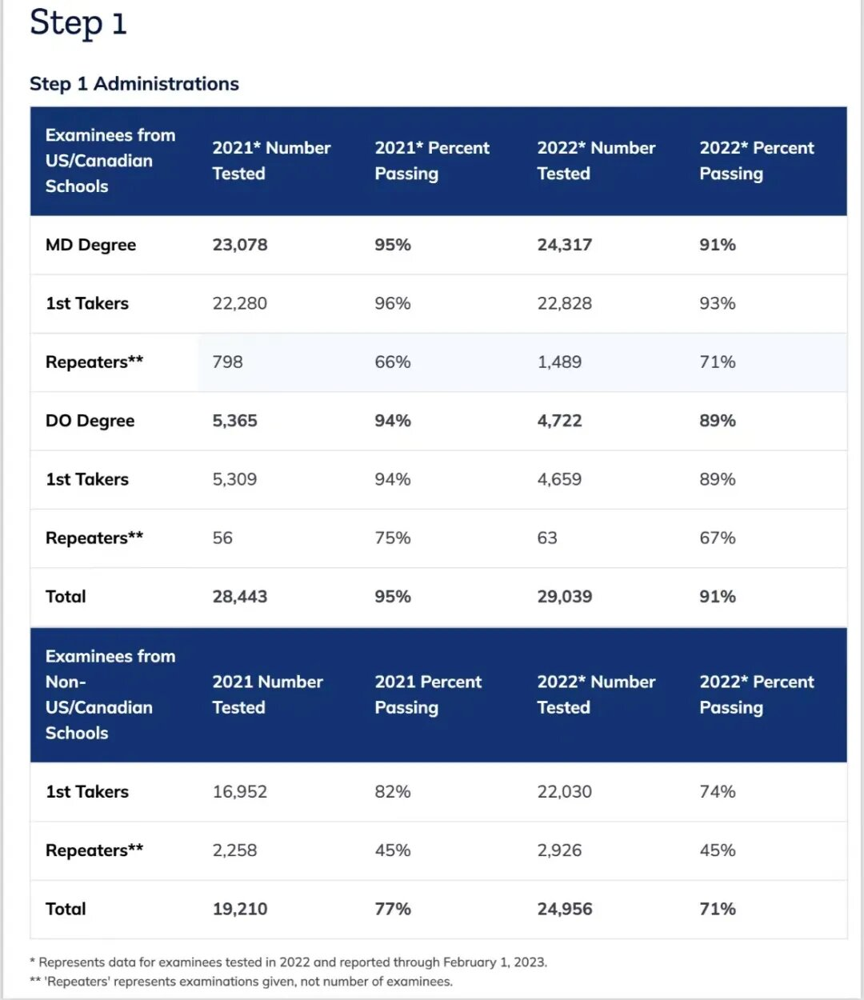
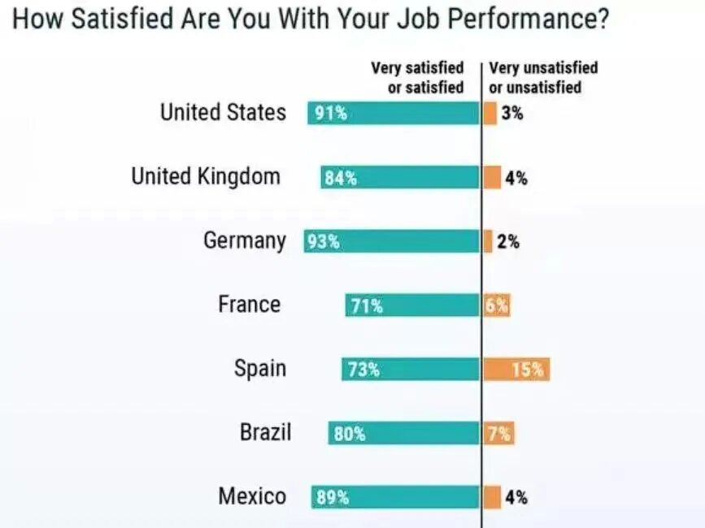
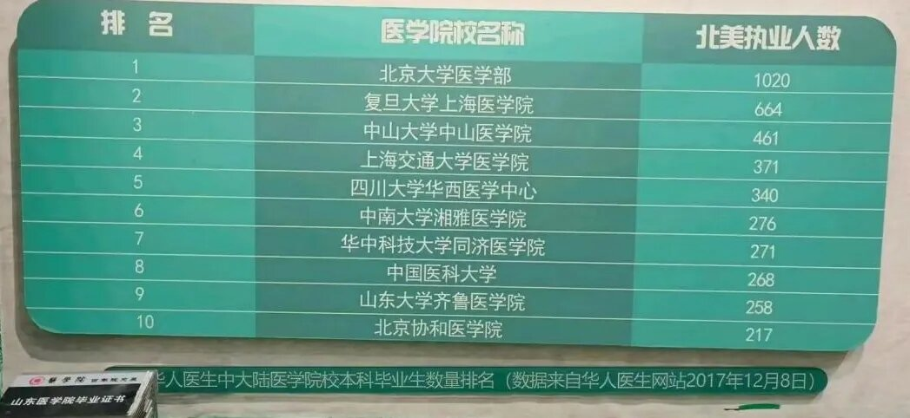

# 3、从医行 | 6个月速通美国执医USMLE-STEP1攻略（下） 

> 本文转载自
> https://mp.weixin.qq.com/s/ySqHCaUNo2WQZLFK5AN6hw

本系列为全网最全系列专栏。今天，我们将推出本专栏的第8篇系列文章：**美国执医USMLE-STEP1一条龙攻略（下）**。从医行专注于保研和留学，本文与海外执医相关。

本文内容宏大，分为上中下三篇，共计**2.5万**字余，笔者从实际出发，分享了完整的考U攻略和心路历程，为目前国内相对而言最新最全的**USMLE攻略**。

关于本文，**作者开篇声明如下**：本文绝大部分经历为笔者自己的观点和经历，糅合以各大论坛，包括但不限于“mitbbs微信群，reddit，discord，小红书平台 北美华医联盟”的所见所得，著作而成。其中得到了包括但不限于wei yixiao，lydia，fufuchigua，ginger老师，kai姐等各位前辈，pddd，nick，考u羊等同伴的建议与指点，在此感谢以上所述，及其他帮助过考u人的所有人。文章数据尽可能标注出处来源，但内容主观性较强，在此声明。另：本文内容不用于任何盈利。

本篇总计**7374**字。

### 一些Q&A

1、Q：第一年match不成功怎么办？

A：攒paper，攒实习经历和LOR，connection（人脉关系），继续参与第二年match。或者拿着ECFMG发的training certificate去药企。国内医学院本科毕业在US等同于MD，身边有朋友拿本科去WES（一个学历认证机构）认证出来就是MD。MD是临床博士，理论上在US的效力远高于phD这种基础类博士（科研蓝领）。

2、 Q：U会看学校吗？必须有绿卡吗？看本科GPA吗？看科研吗？

A：**不看学校**。理论上二本和北协北医在考U上是完全等同的（不考虑connection等外在条件，单纯对学校而言），因为在US，即使是名校，认可度也没有本土医学院高。

有绿卡更好，没有绿卡能卖上的也有大把，不强求。现在考U越发年轻化，大四大五or刚毕业的本科生没绿卡也一样去卖。北美华医联盟公众号，统计的数据是23年match的CMG里有绿卡的占比43%。不看本科GPA，本科成绩单就是一张废纸，考U相关的分数里面，**CK成绩才是唯一**。

有科研更好，方便你进大学医院（大学医院可能会对科研有一定偏好），没有科研的话凭借短YOG，言辞真切的LOR推荐信，或个人特长，CK高分，面试优秀表现等特征，也一样的能卖上。

3、Q：如果在国内行医，考U对我有意义吗？

A：理论上可以学医学词汇，了解真正的西医知识和教学。实际上，毫无意义。有那个时间精力为什么不去练英语口语，考雅思，或留学，锻炼呢？

4、Q：如果我处在大四五/研三，要不要先试着考研/推免/申博or phD or MPH，同时准备U？

A：即使不考虑其他，你确定导师人品OK，能全力支持你U吗？专硕要规培忙的飞起，学硕如果没遇到好老板也一样的没时间。有的学校毕业要求很严格，U的话能顺利毕业吗？既然结果和目的是U，为什么还要绕弯子去考研推免呢？当然其实也有很多人怕自己没了退路，这也是人之常情，本质上是个取舍的问题。

就我身边例子来说，数不胜数的硕博在读同时备考的，S1往往耗时很长（＞1年），且十分消磨人的意志力。白天在实验室/临床基本看不进去书，下班后也只有2-3h的复习时间，还要应付各种生活上的琐事。尤其是看到和自己同时起步的小伙伴pass后的考经，自信心会一而再再而三地受到打击。

且其他不谈，不论国内国外，90%的导师都不会支持自己的学生去考U，毕竟导师是招人来干活的，不是来考试的。理论上，给自己找一条退路是没问题的，但在考U的过程中，我遇到的相当一部分的留好了退路的人却没了殊死一搏的勇气的坚定，继续泯然众人矣。

5、Q：除了USMLE，还有其他的出国行医考试吗？

A：**加拿大MCQQE，UK的PLAB，澳洲AMC，香港LMCHK，新西兰NZREX，日本执业医**等等。目前大陆考U的占比是断崖式领先，香港其次。日本和UK的也有部分人，其余就零零散散了。

HK行医的收入也比较可观，HK公立医院是按照资历来开工资，薪水不会比US低多少。HK的LMCHK考试中，笔试（part1和2）难度低于US，但有去医院实操查体问诊的内容（即part3），另有优点是包实习，但缺点是就业相对困难，考完了LMCHK且完成实习后也不见得能好留HK。碍于篇幅所限，我在此不多介绍，感兴趣可以到xhs或公众号自行收集信息

6、Q：Step1 fail了怎么办？

A：**fail了会有记录，部分医院在match时也会要求S1，CK必须一次通过。fail会极大地影响后续实习和match，一定不能fail**。如果真f了，要么放弃U（因为pass相当于以前分数时代的190+，而从前S1平均水平是230+，如果f了说明你不适合考U），要么至少间隔3个月再重新报名和考试（1195刀的考试费需要重新缴纳）

7、Q：我英语不好/六级没过怎么办？

A：这个考试最重要的就是你的决心，**它本质上是医学考试而不是英语考试**。即使英语好的人，他会的也是日常英语，而非专英。但凡考这个的，专英都得重新学。像我之前专英有些许底子，学micro微生物和neuro神内章节的时候也非常痛苦。

听起来很难适应的生活，其实渐渐走投无路你了也都能适应。一句话，菜就多练。

8、Q：我本科是天坑专业，如儿科精神等，考U也是只能match这些吗？

A：本科专业对U来说就是个笑话，不值一提，白医大有骨外硕士毕业最后match到了放射的，其余例子也是数不胜数。何况，即使是考研，二级学科本换到其他专业的情况还少见吗？

国内二级学科本这个问题的本质在于当下部分天坑科室缺人，上面又不想提高待遇，所以开了本科二级学科来挖坑，在考研/推免设置障碍来逼你留下。临床和二级本的本科教学内容根本没区别（毕竟即使规培了三年，大家也都是一直在跑腿打杂）。

我个人很难理解，为什么90%的二级学科本都对自己的本科专业有执念。比如一同学儿科本，实际上她高考调剂的儿科，自己也并不是非儿科不读，那为什么不去考虑换个喜欢的科室呢？

窃以为，不论是U还是考研，二级学科本都应该将自己视为临床医学大类五年制，报考科室/专业应该是我想要去读什么，而非是因为我本科是这个，所以我以后就一定干这个。这个学校不允许跨考专硕那就换个学校呗，树挪死人挪活不是吗？

我见过无数明明不喜欢本科专业（点名儿科学和麻醉）考研却依然报了该专业的。本科同专业共50人，换了其他科室的算我只有2个人，录取上岸的全部走的儿科。即使大家都知道，也依然铁了心要读。

但，别人可以强忍着吃史，我不行。我不甘心。我要站着把钱挣了。

9、Q：为什么别人大都是12个月起步的备考S1，你却能6个月速通STEP1？

A：**决心如铁般坚定+脱产全职备考+考研底子仍在+自律性强到令人发指+备考路线规划清晰=6个月速通S1**。三年前的我因为懦弱放弃了它，如今我只有这一条路可选，一志愿落榜后，这就是我最后的机会。我从没想过自己能失败，客观上看，整体IMG通过率70%+，我不信自己会是那后30%。

现在Pass相当于分数时代的192分，pass都不到就相当于以前别人都230,240+的分，自己才190都不到。这可能吗？印度巴基斯坦那帮阿三哥都能pass，我会比他们差吗？我不信。过年期间都能坚决的早8晚10.5，风雪无阻，就这样学了6个月，考研西综我在全国起码也是前20%的成绩，S1我如果fail了那至少一半报STEP1的中国人也都得fail。尽管并非学霸，但这是我最基本的自信。

此外，在我把赴美行医的想法和妈妈聊了以后，尽管心里或许有不舍，但言语上仍100%支持我，高昂的实习费用她也满不在乎。为了给她最好的物质条件，这是我考U路上的最大动力，没有之一。为此我可以付出任何代价，承受一切痛苦，什么困难都将被我克服。

再者，和导师说了U的情况后，他也表示全力支持，让我放手去试，实验什么的也不要紧。为了这份信任，我也必须成功，不能失败（至少不能折在S1 CK这种人力能控制的纯考试上）。

我最引以为傲的一是头脑，二是狠劲。

我很清楚自己想要什么，不想要什么，为了我的目标我需要做什么事情，付出什么代价。我当下的优势和劣势是什么，以及如何逼自己变强。

其实相较于一名医（学）生，我更引以为傲的是运动员的身份。2016年跑步，17年开始接触马拉松竞赛，至今跑了2w公里，月跑量维持在270-310公里，7年里参加了20来场路跑（半马居多），2场35k 1900米爬升的越野，公路车也零碎玩了几年。将来到美国发展铁三or公路是我的一大愿望，发达国家的体育氛围更好，去轻松的科室也能有自己的时间来培养爱好，这也是赴美的动力之一。一句话，我要选择的权利，说“不”的权利！

不论零下25度的严寒，还是最高35度的酷暑，练不能停。与天斗，其乐无穷。尽管训练时肌肉会酸痛，会尖叫嘶吼着让你立刻停下，跑后的成就与满足感胜过一切短平快的电子垃圾带来的奶头乐。**沉溺于游戏，追剧，吃喝逛街只会带来悔恨，短暂的放松与刺激后是无尽的空虚，消磨了时间却什么都没能获得**。这种生活只能令人心生厌恶。

朋友圈晒图的同学尚不到而立之年就已大腹便便，看不出一丁点儿依稀的少年轻狂意气风发，我为自己7年来永远保持健康的作息，饮食，运动，以及满分的身材而感到骄傲。当下已达标国家三级运动员，成绩达标国二也是我明年的希冀之一。有这种对自己严格的高标准高要求，我相信自己做其他事也不会输给别人。

10、Q：到了美国以后的身份怎么解决？

A：家里有产业的可以走80w刀投资换绿卡，有文章的走科研，都没有的就慢慢熬个8-10年，或者嫁/娶本地土著。以前US医院会sponsor（赞助）绿卡，现在行情不如以往，这种赞助少了很多。但依我来看，现在想这些内容实在多余，就像还没学会吃饭就考虑开飞机的事。何况如果卖上了，有的是资源去慢慢解决身份。身份是次要矛盾，能否卖上才是主要矛盾。

另，医生在US排green card是不需要抽签的，慢慢排个十年八年总能排到。如果自己科研有成果，引用够高，直接申NIW绿卡也有可能。当然这就是另外一个话题了

11、Q：看了你的文章之后有点想考U，有什么建议吗？

A：先把文章从头到尾再仔细阅读一遍，不放过每一个字。随后请问自己几个问题。我能吃得了少则2年多则5年的这个苦吗？我能得到家里人的支持吗？我的意志足够坚定吗，即使第一年match失败了也能接受吗？match失败了我有什么打算？我能接受美国的文化，饮食的差异吗？我能放弃考研or推免or其他种种而不后悔吗？我有严谨的思维，理性的头脑，不屈不挠的，钢铁般顽强的精神来克服考U道路上的种种困难吗？

过来人都明白，**考试其实只是整个环节里面最简单的一步**。实习需要自己找项目，哪些项目好，哪些不行，还得给教秘发邮件打电话去问，中途又要搞住宿，搬家，来回交通。而且有些州或项目是非常歧视亚裔的。面试和Match就更加复杂了。开销也是花钱如流水，以4周为单位，少于2000刀的大学项目都是抢手项目，2k到4k刀才是家常便饭。最贵也最好的USCD/JHU项目更是1.1w刀/8周和1w刀/6周。

此外，**信息也是非常重要的一环**，一些性价比极高的项目，最典型的如KUMC（堪萨斯大学），申它的elective（在校生可申的实习，能上手实操）得提前1到2年申请。一位妹妹在考完S1后才知道这个，而错过了申请时间，后悔不已。她当时也没想到需要提前这么久就开始交蹲坑费来排队，一直以为是先等到考完step1再去了解实习。

所以，一切都非常考验整个人的综合能力，财力，以及运气。每一步都不能出（大）错。

后面如果不能说服自己，或者单纯是羡慕US的薪水待遇而没能考虑其他因素，那么请尽早打消这个念头。真正适合考U的人其实千不存一。

**如果确定考U，请给自己找一个/多个“我不得不坚持下去的理由”，并以此为根基，坚定不移地走下去**。

12、Q：有问题可以咨询你吗？

A：信息化时代熟练运用社媒来解决问题是最基本的能力。小红书，discord，reddit都是很好的平台。

要咨询，请保证逻辑性。如“你好，我是XX，我的问题罗列如下，是XX，我当下了解的情况是XX，目前出现了XX困难，希望你帮忙解决or指点XXX”。高效解决问题，方便你我。

在我和师兄师姐or前辈发微信时，会把姿态放的很低，同时先打好草稿，问题列在word里，1,2,3,4几点，对方回复后直接说我整理好了问题，随后截图发过去。没有人能拒绝这样的提问。这种方式在我看来也是最基本的能力和社交礼仪。

13、Q：为什么最近几年的pass rate变低了？

A：考U羊总结的2个原因。**一方面是现在的题目难度比改革前会更难，因为题库每年都会更新**。从free120的变化就能看出来，free120是官方发布的相对最贴近真实考试的模拟题，24年的free120对比前几年的free难度有明显提高，而这也是将来发展的趋势。

**另一方面则可能是改革为P/F后，有不少学生觉得pass很容易，草率上了考场当炮灰**。因为在分数时代，S1的分数也是match时候的一个重要参考，改成PASS/FAIL后理论上只要能pass，管他对应分数多少，这一心态使得一部分考生掉以轻心。结合近几年题目难度的抬高，从而出现pass rate的连年降低。但依我看来，CMG完全不必担心这一情况，因为中国人最不怕的就是考试，换句话说，USMLE里面考试占比越多，考的越难，整体情况就是越利好CMG。

14、Q：什么时候开始考U最合适？

A：**最合适的就是高考后本科刚入学时**，既能开始相关的医学培养，又能极早地接触到相对规范到西医医学学习，不论对于后面考CK，托福，还是安排实习。性价比都直达天花板。

**其次就是现在，是今天**！尽管考U日渐年轻态，但30+还在复习的也并不在少数。时间问题本质上并不是说有一个确切的时间点，过了这个点就不能考了。实际是要看你的决心，毅力，以及行动力。只要下狠心，任何时候开始都不晚。若是行动上闲散怠惰，即使高考后第2天开始准备U也没有半点意义，不是吗？

15、Q:我的情况是XXX，请问这样适合考U吗？

A：这样的问题最好自己搜集，整合信息和回答。考U的情况实在太多了。本科和毕业生情况不一样，本科能申elective（与elective对应的是observership，即ob，也就是只能看而不能上手hands-on）而毕业生则不行。5+3又是一个独特的情况，甚至不一样的program里面的要求也不一样。

还有本科休学1年乃至2年的也不少见，总之每个人情况不一，对自己的目标，要求也不一样。有心人应该自己了解这些内容。我始终认为随意询问的，其实也没有强烈的意愿，大多也不会走上这条路。

16、网盘的链接：STEP1备考资料，以及我的谷歌书签（内含我S1考试用的所有网站）链接：https://pan.baidu.com/s/1drMbfN3uGKcyPvXZIy465w?pwd=0129
提取码：0129

17、 Q：有这个毅力，在国内也能混出名堂，何必非得去US？

A：在报考之初我就在知乎见过有人这样说，当时也信以为真了。但如今的我并不这样认为，“橘生淮南则为橘，生于淮北则为枳”，中美的医疗体系和医师培养本就是两种路径。国内对科研的般的奉为圭臬，我相信大部分医学生当初也并非为了成为“医学科学家”而报考临床医学的，萝卜青菜各有所爱，并非每位有毅力决心的同学都能接受国内的培养体系。

此外，在国内读硕/博也好，就业也好，即使存在逆境与困难，都是被大环境推着走。而出国行医则充满了未知，这要求你有走出舒适圈，应对一片未知的心态与能力。

18、Q：考U要不要找中介？

A：全程，不需要也不应该找中介。找中介的目的是什么？是为了解决问题。但U路程中的所有问题都完全能独立解决，从报名考试到最后规培，前者在帖子中写的已经十分详细了，而后者也大多是咨询本科室/本校/意向项目的前辈来解决。你说中介去做个移民/签证什么的还能理解，做USMLE这种每年才一百个来人match高精尖的海外行医考试？至少我是不信的。身边真的有朋友花了大几千报了个中介，结果和我说最后知道客服还没自己懂的多。

### 最后的最后

有一位关系很好的朋友，放弃了八年制临床本博，考研录取TOP2院校，还是自己最喜欢的专业。但规培三个月后，“上临床了发现自己道德水平日渐下降”，“当时放弃八年制考研，算是有心气的，现在真没有了，看透了”。

虽然有玩笑话的成分，但我看在眼里，记在心里。鸡汤也好，鞭策也罢，我会时时刻刻找这些理由来push，警醒自己，**因为对美好生活的向往固然足够诱人，但这些咬牙切齿的恨意与不甘，才是砥砺前行的真正动力**。

在我把初稿发给朋友时，他说“整理的太好了，这份资料肯定不便宜，你也要像LMCHK的Mars做公众号那样付费不”。但我回他，这次我不会像考研那样整理院校和专业资源这些自己的所闻所得来售卖。因为考研是一战不上二战也会上的事情，但U的话，如果开始不知道它，后面就实实在在的不会对它有任何想法。

早在几年前，就曾给几位小伙伴做过一些一志愿/调剂的信息上帮助，看到其中一些人命运的轨迹因自己而发生变动，也是一件很有成就感的事情。

因而我决定把这些内容无偿地投稿于此，**我希望能有更多的人了解到这条荆棘密布但又通往光明的路，我希望能在他人埋怨国内医疗环境时多给他一个选择，我希望即使千不存一，这“一”里，也会有和我一样的勇敢者跳出来，奋身一跃**。

有时会想，**每个人都有自己的选择，只要坚信自己的路是正确的，只要自己不会后悔“我本可以”，那它就值得我们付出一切代价，为之努力**。

**穷且益坚，不坠青云之志**。

### 补充figure

Figure1 医师收入

Figure2 各个科室的match人数

其中non-US IMG是没绿卡的，US IMG就是有绿卡的或本国citizen。  
MD是医学博士，DO是骨科博士（Doctor of Osteopathic Medicine，一种学位，但整体认可度逊于MD）——图源知乎“内科小虾米淼冰”

Figure3 知乎上很有灵性的回答

Figure4 US收入（补充版）  
——来源见图

Figure5 定了考试日期后延期考试需要额外缴纳的手续费

before exam是指约的考试的具体日期

Figure6 STEP1 scheduling permit （准考证）

Figure7 STEP1 pass rate  
——来源：ECFMG官方数据

Figure8 官方统计的match上的CK分数  
——来源见图

Figure9 套图 手机存的忘了在哪看到的统计数据了

Figure10、北协没有五年制临床，此处是指八年制本博/考研考博过去的  
所以人很少——来源见图

下图源于一个已注销的网站（记不清名字了），且数据存在一定滞后性

注：窃以为，海外行医已经十几年了，但仍有相当多的人并不清楚个中情况，会认为“没有绿卡就不能match”，“本科是麻醉/影像，是不是不能考U”，对这些琐碎问题的整合，仍然缺少一份全面的基础扫盲式攻略，我对此深感遗憾与痛心。

如若认可我的内容与观点，并顺手将其转发给朋友/朋友圈/同学/班级群/学校群，我将不胜荣幸与感激。
