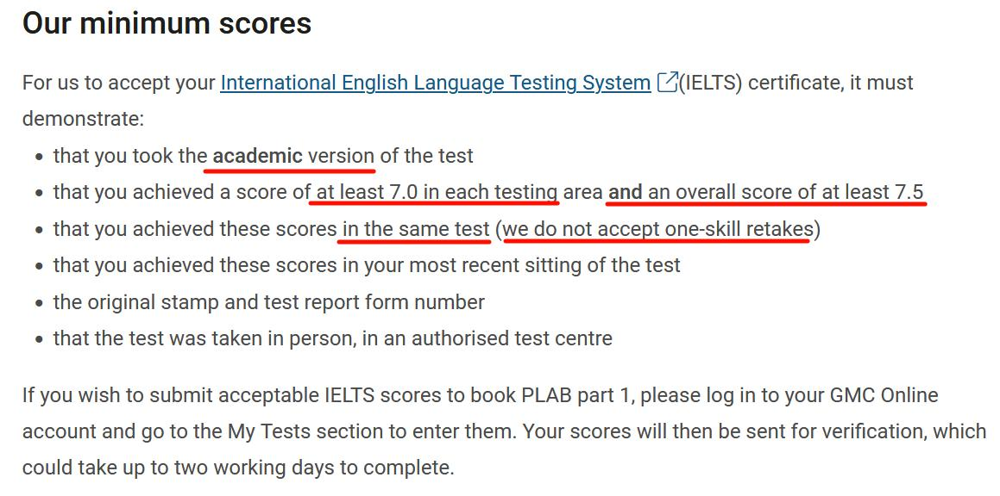
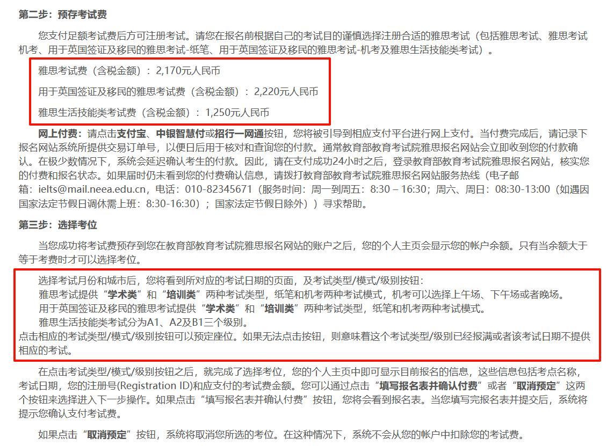
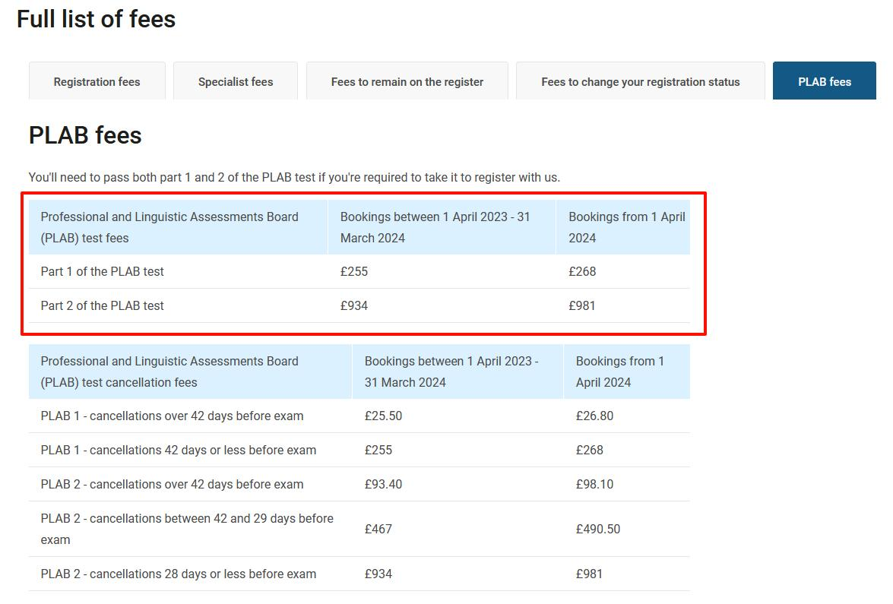

# 开始

::: details 一些碎碎念
- 你连英语单词都坚持不下来，连考研都坚持不下来，还打算考什么PLAB呢
:::

::: details PLAB链接
https://www.gmc-uk.org/registration-and-licensing/join-the-register/plab
:::

## 1、你的英语证明 *Evidence of your knowledge of English*

**使用雅思成绩 Using your IELTS certificate**

- 只接受**学术型**雅思测试
- **每个项目至少7.0，总分至少7.5**
- **且要在同一次考试中**
- 雅思成绩有效期为**两年**

::: details 官方链接
https://www.gmc-uk.org/registration-and-licensing/join-the-register/before-you-apply/evidence-of-your-knowledge-of-english/using-your-ielts-certificate
:::

::: details 官网说明

:::

## 2、费用 *Fees*

| 项目 | 雅思 | PLAB1 | PLAB2 |
|------|-------|-------|-------|
| 费用 | ¥2170 | £268  | £981  |

::: details 官网说明
雅思

PLAB

:::

::: details 官网链接
雅思：https://ielts.neea.cn/registrationprocess_cn.html  
PLAB：https://www.gmc-uk.org/registration-and-licensing/managing-your-registration/fees-and-funding#plab
:::

::: tip 最后更新
以上内容最后更新时间为2024.09.04
:::

