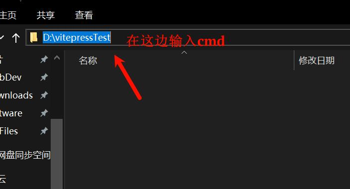
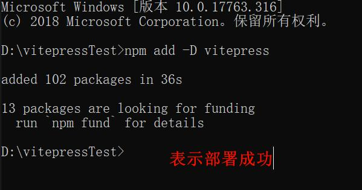
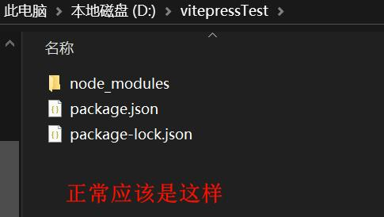
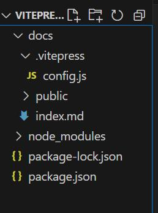
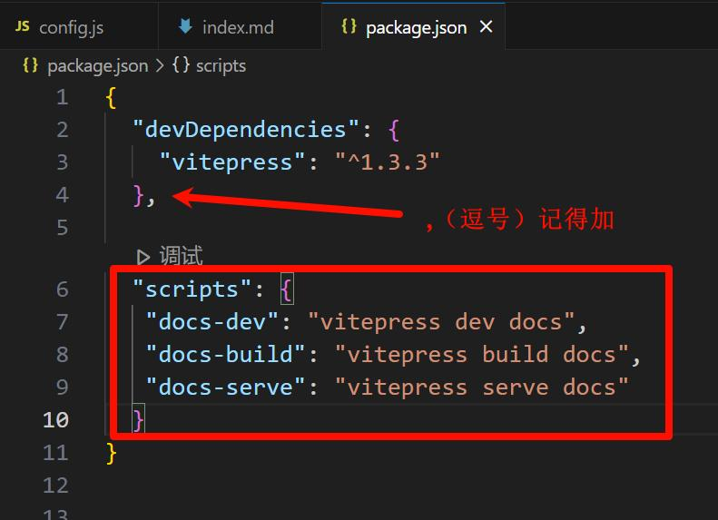
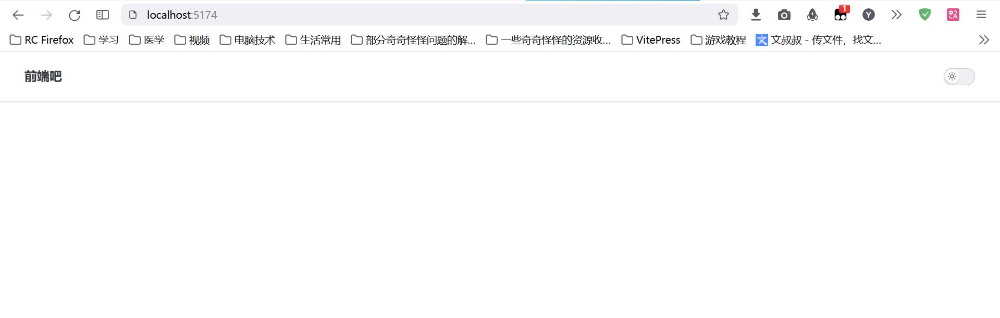

# 1、VitePress的安装和运行

> 本文参考：http://www.qianduan8.com/2015.html

## 一、Vitepress相关文档

官方英文文档：https://vitepress.dev/  
官方中文文档：https://vitepress.dev/zh

## 二、部署与安装

1. 安装Node.js
   ::: details Node.js 链接
   https://nodejs.org/zh-cn
   :::
2. 新建一个文件夹，如vitepressTest，在此文件夹内打开cmd窗口
   ::: details 查看图片
   
   :::
   
3. 本地项目安装VitePress（可能要开启*全局科学上网*）  
   ```
   npm add -D vitepress
   ```
   ::: details 查看图片
   
   
   :::
   
4. 配置项目目录结构  
   我们创建一个**docs/.vitepress**的目录和配置文件、首页，public。 
   ::: details 查看图片
   
   :::
   
   ::: info 说明如下
   **docs/.vitepress**: 用于存放全局的配置、自定义组件， 自定义主题（theme）等。  
   **config.js**: 项目配置文件。  
   **public**: 公共文件目录，存放静态资源目录。（之后在首页和主题配置里可以直接使用 “/logo.png”引入）  
   **index.md**：则是站点的首页。  
   其中，config.js是配置VitePress网站的必要条件，它将导出一个JS对象，如果项目越来越大时，配置可以抽出来。 
   :::

   config.js初步配置如下：
   ``` js
   export default {
      title: '前端吧',
      description: '关注web前端开发为主的博客网站和前端网址大全',
      // 打包目录 outDir: './dist',
      head: [
      // 添加图标
      ['link', { rel: 'icon', href: '/favicon.ico' }]
      ],
   }
   ```
   如上所示，我们只简单地设置了网站标题，网站描述，打包的 dist 目录，以及网站图标，后面更多配置都是在config.js这个文件完成。

5. 配置运行脚本
   在package.json下配置，如下：
   ``` json
   "scripts": {
      "docs-dev": "vitepress dev docs",
      "docs-build": "vitepress build docs",
      "docs-serve": "vitepress serve docs"
   }
   ```
   ::: details 查看图片
   
   :::

6. 本地运行
   ```
   npm run docs-dev
   ```
   或
   ```
   pnpm docs-dev
   ```
   效果如下，现在还没有什么内容，接下来我们就开始配置博客的首页 
   ::: details 查看图片
   
   :::
