# 2、VitePress默认首页、头部导航、左侧导航配置和右侧边栏配置

> 本文参考：http://www.qianduan8.com/2024.html
> 本文参考：https://segmentfault.com/a/1190000044948735

## 三、默认首页配置

配置首页之前，我们需要了解VitePress的默认主题，它是提供了首页布局，通过设置 layout 选项为页面 frontmatter 来选择页面布局。

layout 主要有 3 个布局选项doc, page, 和 home
::: info 详细如下
`layout: doc` doc 是默认布局，它将整个 Markdown 内容样式化为“文档”外观。

`layout: page` 选项 page 被视为“空白页”， Markdown 仍然会被解析，并且所有 Markdown Extensions 与 doc 布局同样生效，但它不会获得任何默认样式。

`layout: home` 选项 home 将生成模板化的“主页”，在此布局中，您可以设置额外的选项，例如hero和features。

`layout: false` 无布局（纯空白页），解析 Markdown 但不会获得任何默认样式
:::

### 1、首页配置

那么我们想要配置主页，选择layout: home 即可，它有hero和features两个部分的配置。

首先在**index.md**顶部，写入如下代码
```markdown
---
layout: home
---
```
这样我们就开启了首页的布局配置，之后，我们就可以通过设置其他选项（如 hero 和 features）进行配置了。

#### 1.1、Hero 部分

Hero 部分位于主页顶部，下面是如何配置 Hero 部分。要注意缩进。
```markdown{3-9}
---
layout: home
hero:
    image: 
        src: /logo.png
        alt: 前端吧
    name: 前端吧
    text: 关注web前端开发为主的博客网站和前端网址导航
    tagline: 收集有一大批前端相关的技术网站，包括Vue、React等技术资料的生态网站
---
```
::: info 注释
`name` 是文档标题

`text` 是类似文档副标题内容

`tagline` 文档标语
:::
基本效果如下：

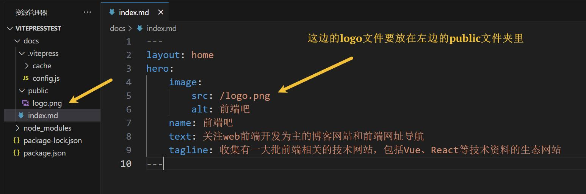

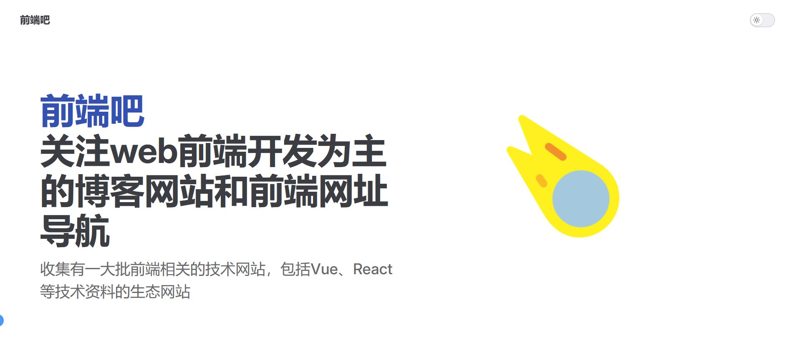


有一点VitePress首页的样子了，在后面我们还会跟大家说下怎么修改样式

#### 1.2、按钮部分

按钮部分主要通过actions来配置的（注意actions的缩进），如下： 
```markdown{11-17}
---
layout: home
hero:
    image: 
        src: /logo.png
        alt: 前端吧
    name: 前端吧
    text: 关注web前端开发为主的博客网站和前端网址导航
    tagline: 收集有一大批前端相关的技术网站，包括Vue、React等技术资料的生态网站

    actions:
    - theme: brand
      text: 开始使用
      link: /guide/start
    - theme: alt
      text: 前端吧官网
      link: http://qianduan8.com/
---
```
::: info 注释
`theme` 是按钮的主题，只有 brand 和 alt 两种，也就是分别对应目前网页中蓝色和灰色按钮

`text` 是按钮的文字

`link` 是按钮的链接，点击后跳转，可以是网址URL，也可以是文档中的绝对路径，根路径是 docs，可以省略文档类型，默认是 .md
:::


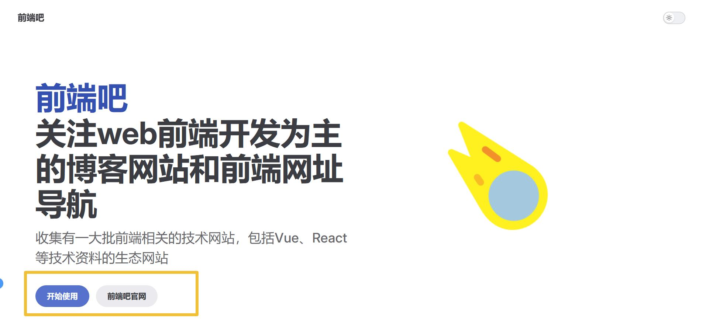


比如上面的配置/guide/start链接，我们在 docs 下创建 guide 目录，再在 guide 目录下创建 start.md 文件，输入一些文字试试。
```markdown
# 开始访问官网-测试内容
[前端吧官网](http://qianduan8.com/)
```

点击跳转到页面内容如下：

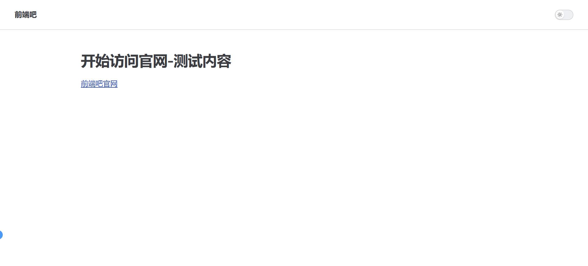


#### 1.3、features 部分

features部分：简单说就是网站文档说明或者附加内容部分，具体看最终效果就知道了。

```markdown{19-33}
---
layout: home
hero:
    image: 
        src: /logo.png
        alt: 前端吧
    name: 前端吧
    text: 关注web前端开发为主的博客网站和前端网址导航
    tagline: 收集有一大批前端相关的技术网站，包括Vue、React等技术资料的生态网站

    actions:
    - theme: brand
      text: 开始使用
      link: /guide/start
    - theme: alt
      text: 前端吧官网
      link: http://qianduan8.com/

features:
  - title: UnoCSS
    details: Unocss是一种基于PurgeCSS的CSS框架,它可以帮助你更简洁、更高效地编写CSS。 Unocss的语法非常简单,它采用了类似于Tailwind CSS的类名方式。
    link: https://unocss.dev/
    linkText: 了解更多
  - title: Vue3
    details: 渐进式JavaScript框架.
    link: https://cn.vuejs.org/
    linkText: 了解更多
  - title: vitePress
    details: Vite & Vue Powered Static Site Generator.
    link: https://vitepress.dev/
  - title: Pinia
    details: 符合直觉的Vue.js 状态管理库.
    link: https://pinia.vuejs.org/zh/
---
```

::: info 注释
`icon` 是每个 feature 盒子的图标

`title` 是每个 feature 盒子的标题

`details` 是每个 feature 盒子的详细描述内容

`link` 是每个 feature 盒子的单击要素组件时链接，简单说就是链接地址，链接可以是内部链接，也可以是外部链接。

`linkText` 是每个 feature 盒子的链接要显示在要素组件内部的文本，简单说就是链接文本。最好与 link 选项一起使用。
:::

效果如下：

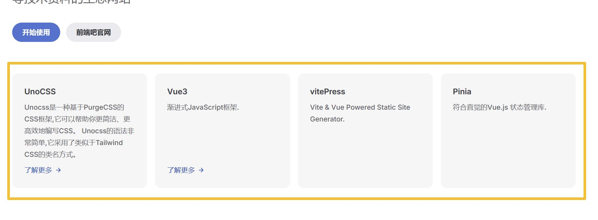


### 2、头部导航栏配置

我们可以通过配置文件**config.js**中的themeConfig选项定义主题配置，通过它我们可以配置网站的**logo、主导航、标题、侧边导航**等等。

在 vitePress 中，一个 .md 文件就可以作为一张页面，并且，在根目录 docs 中.md可自动生成路由。

所以头部导航的配置，只需在config.js中的themeConfig中的nav配置即可，在这我们还可以把logo也配置上

```js{1-2,13-21}
// 头部导航
import topNav from "./topNav";

export default {
    title: '前端吧',
    description: '关注web前端开发为主的博客网站和前端网址大全',
    // 打包目录 outDir: './dist',
    head: [
    // 添加图标
    ['link', { rel: 'icon', href: '/favicon.ico' }]
    ],

    // 主题配置
    themeConfig: {
      // 导航上的logo
      logo: "/logo.png",
      // 隐藏logo右边的标题
      siteTitle: false,
      // 头部导航栏配置
      nav: topNav,
    },
 }
```

然后我们新建一个topNav/index.js文件， index.js代码如下
```js
export default [
    {
      text: "前端网聚",
      items: [
        { text: "前端综合", link: "/site/page" },
        { text: "HTML/CSS", link: "/site/html-css" },
        { text: "框架组件", link: "/site/framework" },
      ],
    },
    {
      text: "技术笔记",
      items: [
        { text: "VitePress", link: "/note/vitePress" },
        { text: "Vue", link: "/note/vue" },
        { text: "react", link: "/note/react" },
      ],
    },
    {
      text: "关于我们",
      link: "/about/page",
    },
    { text: "更新日志", link: "" },
  ];
```

效果如下：

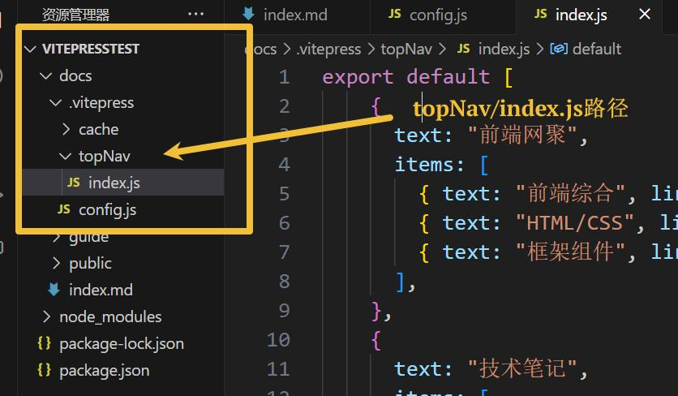

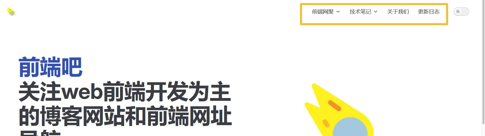


然后我们再创建site、note等相关文件夹和文件即可

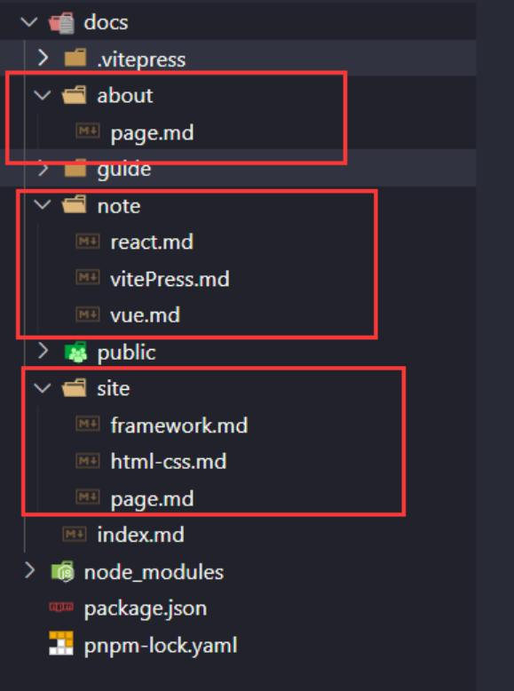

之后就可以在这些md文件编写内容了。

注意点：

这里我发现在创建导航的时候有一个细节要注意，比如关于我们，假如我们创建的是**about/index.md**，这个时候导航就没有选中样式效果。

把index.md改为其他名字即可，比如**page.md**，此时才有选中的样式效果。 

### 3、左侧导航栏配置

**关于左侧导航栏的配置，在themeConfig中的sidebar配置即可**

这里，我们新建一个sideBar文件夹，用于专门放左侧导航栏的js文件，比如我们新建一个vitePressBar.js（**这里如何管理导航文件，根据自己需求处理**）这里提供的是和头部导航栏不同的另外一种方法。


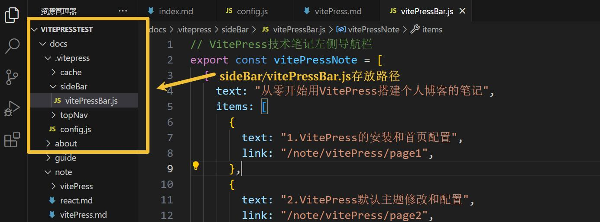


**config.js**
```js{3-4,23-26}
// 头部导航
import topNav from "./topNav";
// 左侧导航栏
import { vitePressNote } from "./sideBar/vitePressBar";

export default {
    title: '前端吧',
    description: '关注web前端开发为主的博客网站和前端网址大全',
    // 打包目录 outDir: './dist',
    head: [
    // 添加图标
    ['link', { rel: 'icon', href: '/favicon.ico' }]
    ],

    // 主题配置
    themeConfig: {
      // 导航上的logo
      logo: "/logo.png",
      // 隐藏logo右边的标题
      siteTitle: false,
      // 头部导航栏配置
      nav: topNav,
      // 左侧导航栏
      sidebar: {
        "/note/vitePress": vitePressNote,
      },
    },
 }
```

**vitePressBar.js**
```js
// VitePress技术笔记左侧导航栏
export const vitePressNote = [
  {
    text: "从零开始用VitePress搭建个人博客的笔记",
    items: [
      {
        text: "1.VitePress的安装和首页配置",
        link: "/note/vitePress/page1",
      },
      {
        text: "2.VitePress默认主题修改和配置",
        link: "/note/vitePress/page2",
      },
      {
        text: "3.如何自定义布局和主题样式修改?",
        link: "/note/vitePress/page3",
      },
      {
        text: "4.如何自定义布局页面模板？",
        link: "/note/vitePress/page4",
      },
      {
        text: "5.第三方组件库的使用-组件库文档",
        link: "/note/vitePress/page5",
      },
    ],
  },
];
```
然后新建相关页面即可

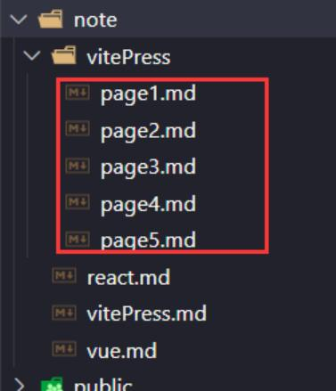


效果如下：

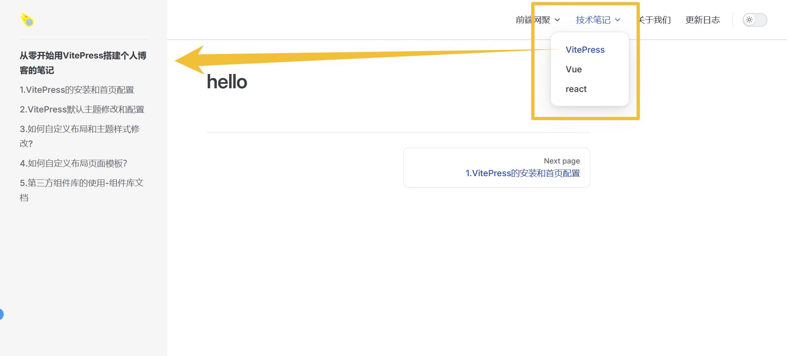

### 4、右侧边栏配置

右侧边栏是大纲中显示的标题导航块

配置 `outline` 字段可以设置渲染大纲层级

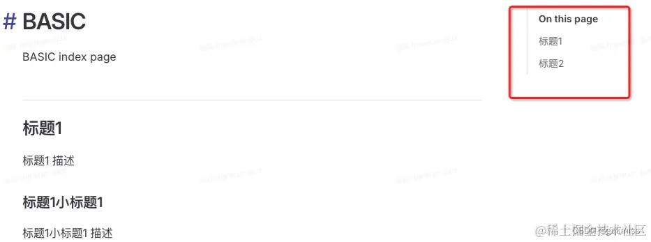

可以看出默认只展示了 h2 标题，outline 的默认值为 2

在 themeConfig 中添加 outline 字段，没有 true 类型，只有 false，设置 `false` 时不展示右侧边栏

1、单个数值
```js
export default defineConfig({
  themeConfig: {
    ...,
    outline: 3,
  }
})
```
只展示 h3 标题

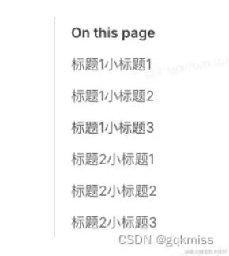

2、deep 字段

当为字符串时，只有 `deep` 一个字段，与 [2, 6] 相同，展示 h2~h6 所有标题

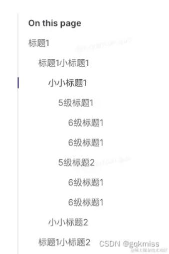

3、数组形式

```js
export default defineConfig({
  themeConfig: {
    ...,
    outline: [2,5],
  }
})
```
展示 h2~h5 的标题

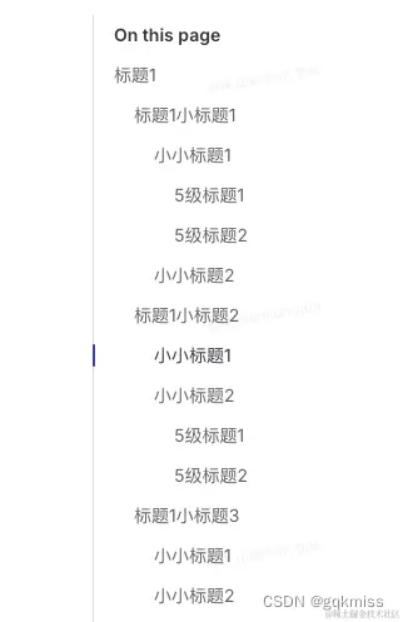

4、对象形式

```js
export default defineConfig({
  themeConfig: {
    ...,
    outline: {
      level: [2,4],
      label: '当前页'
    },
  }
})
```
当是对象形式的时候，有 level 和 label 两个字段

`level`: number | [number, number] | 'deep'，是展示标题等级  
`label`: string，是 outline 的标题，替换 On this page 文案

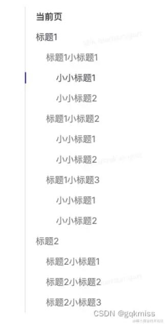

5、在当前页面中覆盖 config.js 中的配置

在 basic/index.md 文件顶部写入以下内容
```
---
outline: 'deep'
---
```
```
---
outline: 
  level: [1,3]
---
```
在当前页面的 outline 中配置 label 不生效，还是会用到 config.js 中的配置或者默认值

6、展示在页面内容左边

将 `aside` 设置为 `left`
```
---
outline: 
  level: [1,3]
  label: 基础篇
aside: left
---
```