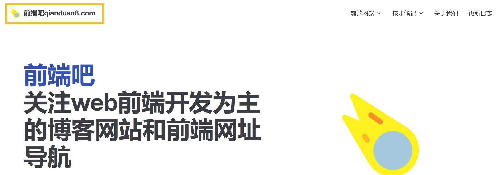
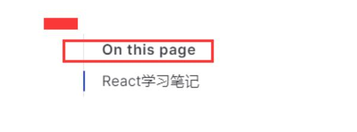
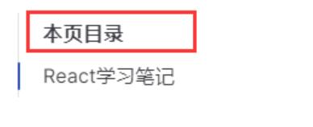

# 3、VitePress页脚、标题logo、最后更新时间等相关细节配置

> 本文参考：http://www.qianduan8.com/2030.html

## 五、默认主题相关细节配置

关于默认主题相关细节配置，我们也是通过配置文件config.js中的themeConfig选项来配置的，以下所有配置都是在**themeConfig**中完成的

### 1、修改顶部网站的logo和标题

默认情况下，网站的logo会引用 config.title 配置的站点标题。如果想修改网站的logo标题，则可以在 themeConfig.siteTitle 选项中设置定义标题。
```js
export default {
    themeConfig: {
      siteTitle: '前端吧qianduan8.com'
    }
}
```
上面是纯文本的logo文字，如果想修改为图片来展示网站的logo，则可以通过如下设置

添加logo后将会与网站标题一起显示。如果只想要展示logo而隐藏标题，请将 siteTitle 设置为 false。
::: details 查看图片

:::

logo应该直接放在 public 中，并定义为绝对路径。

```js
export default {
    themeConfig: {
      // 导航上的logo
      logo: "/logo.png",
      // 隐藏logo右边的标题
      siteTitle: false,
    }
}
```

### 2、自定义编辑链接

```js
// 主题配置
themeConfig: {
  // 编辑链接
  editLink: {
    pattern: "https://github.com/vuejs/vitepress/edit/main/docs/:path", // 自己项目仓库地址
    text: "在 github 上编辑此页",
  },
},
```
::: details 查看图片

:::

### 3、页脚配置

```js
themeConfig: {
  // 站点页脚配置
  footer: {
    message: "Released under the MIT License",
    copyright: "Copyright © 2023-present Lao Yuan",
  },
},
```
::: details 查看图片

:::

### 4、顶部导航最后边社交链接配置

```js
  socialLinks: [
    { icon: 'github', link: 'https://github.com/vuejs/vitepress' },
    // 也可以自定义svg的icon:
    {
    icon: {
        svg: '<svg role="img" viewBox="0 0 24 24" xmlns="http://www.w3.org/2000/svg"><title>Dribbble</title><path d="M12...6.38z"/></svg>'
    },
    link: '...'
    }
  ]
```
::: details 查看图片

:::

### 5、文档右边侧边栏配置

默认就已经是如下配置了：
::: details 查看图片

:::

想要修改如下设置即可
```js
  // 右侧边栏配置，默认值是"In this page"
  outlineTitle: "本页目录",
```
::: details 查看图片

:::

### 6、最后更新时间配置？（我自己尝试没有成功）
最后更新时间需要在 themeConfig 平级去开启此选项，然后在 themeConfig 中可以去定制其展示文字。需要注意的是配置之后不会立即生效，需要git提交发布服务器之后可以生效，如下：

```js
// 获取每个文件最后一次 git 提交的 UNIX 时间戳(ms)，同时它将以合适的日期格式显示在每一页的底部
lastUpdated: true, // string | boolean
// 主题配置
themeConfig: {
  lastUpdatedText: "最后更新", // string
}
```

### 7、Algolia 搜索（当前文档搜索配置）

这个需要去官网https://docsearch.algolia.com/apply 申请key才可以，这里自己就不申请配置了，网上也有相关的文档说明。
```js
  // 搜索
  algolia: {
    apiKey: "your_api_key",
    indexName: "index_name",
  },
```
::: details 查看图片

:::