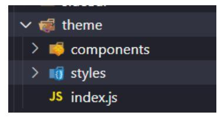
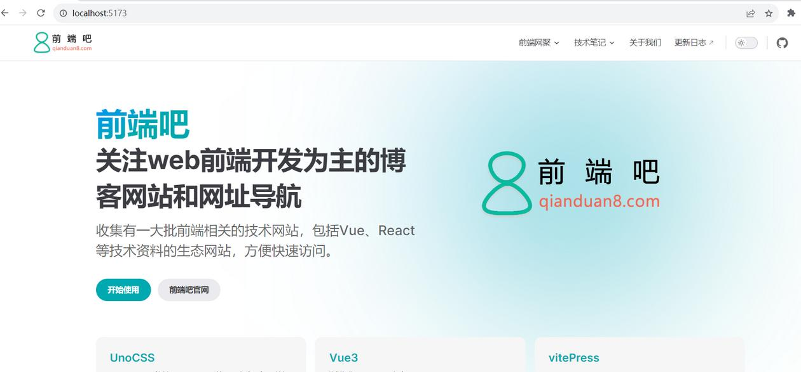
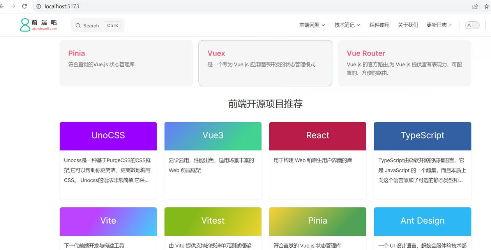

# 4、（进阶）如何自定义首页布局和主题样式修改？

> 本文参考：http://www.qianduan8.com/2041.html

## 六、首页样式修改

有时候觉得自带的样式不好看，想自定义，首先我们在docs/.vitePress新建一个theme文件夹，用来存放自定义布局和主题修改的相关文件，如下所示

::: details 查看图片

:::

theme下再新建custom.css 和 index.js

**custom.css**我们用来写修改样式的，当然也可以安装css预处理器来写样式。  
**index.js**是入口文件，用来注册组件和配置自定义布局的。

VitePress 对 CSS 预处理器有内置支持：.scss、.sass、.less， .styl 和 .stylus 文件。 不需要为它们安装 Vite 特定的插件，但必须安装相应的预处理器

这里我们选择使用sass，安装即可
```
pnpm install -D sass
```

编写**custom.scss**

通过浏览器开发工具，找到对应的样式选择器，覆盖原本的CSS即可修改默认主题的样式。 

```css
/** 
  主题变量样式修改
**/
/* :root {
  --vp-c-brand: #656dff;
  --vp-c-brand-light: #757cff;
} */
    
/** 
  顶部导航模块样式修改
**/
.VPNav {
  .VPNavBar {
    background-color: #fff;
    border-bottom: 1px solid rgba(60, 60, 67, 0.13);
    }
  .VPNavBar.has-sidebar{
    .curtain {
      bottom: -30px !important;
      /* 导航的底部边框不显示问题修改 */
      &::before {
        margin-top: 2px !important;
      }
    }
  }
  .logo {
    height: 40px;
  }
}
    
/**
  内容模块样式修改
**/
    
.VPContent {
  .VPDoc {
    padding-left: 0 !important;
  }
  /* 内容左边距调整 */
  .content-container {
    margin-left: 20px !important;
  }
  /* 副标题样式修改 */
  .container .text {
    font-size: 46px !important;
  }
}
    
    
/**
  暗黑模式样式修改
**/
.dark {
  .VPNav .VPNavBar {
    background-color: #1e1e20;
    border-bottom: 1px solid #000;
  }
}
```

**index.js**
```js
import DefaultTheme from "vitepress/theme";
import "./custom.css";
  
export default {
  ...DefaultTheme,
  NotFound: () => "404", // <- this is a Vue 3 functional component
  enhanceApp({ app, router, siteData }) {
    // app is the Vue 3 app instance from createApp()
    // router is VitePress' custom router (see `lib/app/router.js`)
    // siteData is a ref of current site-level metadata.
  },
};
```

### 1、首页标题和图片渐变色调整

标题渐变色和logo背景渐变色调整

可参考https://vitepress.dev/、https://unocss.dev/等，根据情况调整成自己喜欢的样式
```css
:root {
  /* 按钮颜色 */
  --vp-button-brand-bg: var(--vp-c-brand);
  /* 首页标题和图片渐变颜色 */
  --vp-home-hero-name-color: transparent;
  --vp-home-hero-name-background: -webkit-linear-gradient( 120deg, var(--vp-c-brand) 45%, var(--vp-c-brand-next) );
  --vp-home-hero-image-background-image: linear-gradient( -45deg, var(--vp-c-brand) 45%, var(--vp-c-brand-next) );
  --vp-home-hero-image-filter: blur(180px);
}
```

### 2、样式动态变化

参考https://unocss.dev/官网效果。

源码地址：https://github.com/unocss/unocss/blob/main/docs/.vitepress/theme/index.ts

引入import ‘./rainbow.css’，文字颜色等可以动态变化。

需要变化的地方加上如下变量即可，比如
```
border: 1px solid var(--vp-c-brand);
color: var(--vp-c-brand);
background: var(--vp-c-brand);
```

最终效果如下：
::: details 查看图片

:::

## 七、自定义首页模板
当然如果你想自定义首页内容，你可以编写Vue组件的方式实现，首先要安装Vue
```
pnpm i -D vue
```

然后自定义编写好组件后，然后在index.md引入即可

比如我们这里简单写一个home.vue试试
```
<template>
  <div class="ui-home">
    <h2 class="ui-title">前端开源项目推荐</h2>
    <ul class="ui-project">
      <li class="item" v-for="v in siteData" :key="v.name">
        <a class="link" :href="v.link" target="_blank">
          <h3 :class="['title', v.className]">{{ v.name }}</h3>
          <p class="desc">{{ v.desc }}</p>
        </a>
      </li>
    </ul>
  </div>
</template>
<script setup>
import { siteData } from '../model/siteData.js'
  
</script>
<style lang="scss">
.color-pink1 {background: #90f;}
.color-red {background: #b91d47;}
.color-blue-deep4 {background: #3360a3;}
.color-blue-light6 {background: #2db7f5;}
.color-green-gradient1{
    background: -webkit-linear-gradient(120deg, #86b91a 30%, #edd532);
    background: linear-gradient(120deg, #86b91a 30%, #edd532);
}
.color-green-gradient2{
    background: -webkit-linear-gradient(315deg, #42d392 25%, #647eff);
    background: linear-gradient(315deg, #42d392 25%, #647eff);
}
.color-green-gradient3{
    background: -webkit-linear-gradient(315deg, #51a256 25%, #f7d336);
    background: linear-gradient(315deg, #51a256 25%, #f7d336);
}
.color-pink-gradient {
    background: -webkit-linear-gradient(120deg, #bd44fe 35%, #42d1ff);
    background: linear-gradient(120deg, #bd44fe 35%, #42d1ff);
}
  
  
/**首页网址推荐**/
.ui-home {
  width: 1152px;
  margin: 20px auto;
  .ui-title {
    display: flex;
    align-items: center;
    justify-content: center;
    height: 60px;
    font-size: 26px;
  }
}
.ui-project {
    display: grid;
    gap: 20px;
    grid-template-columns: repeat(auto-fit, minmax(224px, 1fr));
    justify-content: space-between;
    margin-top: 20px;
  .item,
  .link {
    height: 220px;
  }
  .item {
    .link {
      display: block;
      color: #333;
      background: #fff;
      border: 1px solid #f1f1f1;
      border-radius: 6px;
      transition: all .4s;
    }
    .link:hover {
      -webkit-filter: brightness(1.2);
      box-shadow: 0 15px 30px rgba(0, 0, 0, .1);
      transform: rotateY(-0.1deg) scale(1.03) translateZ(0);
    }
    .title {
      height: 80px;
      padding-top: 25px;
      font-size: 24px;
      color: #fff;
      text-align: center;
      border-radius: 6px 6px 0 0;
    }
    .desc {
      line-height: 2;
      padding: 0 12px;
      margin-top: 14px;
      font-size: 14px;
      overflow: hidden;
      text-overflow: ellipsis;
      display: -webkit-box;
      -webkit-line-clamp: 3;
      -webkit-box-orient: vertical;
    }
  }
}
</style>
```

在theme/index.js注册为全局组件，然后在index.md 直接引用即可

```
<Home />
```

效果
::: details 查看图片

:::

github项目地址：https://github.com/msyuan/vitePress-project  
在线预览效果：https://msyuan.github.io/vitePress-project