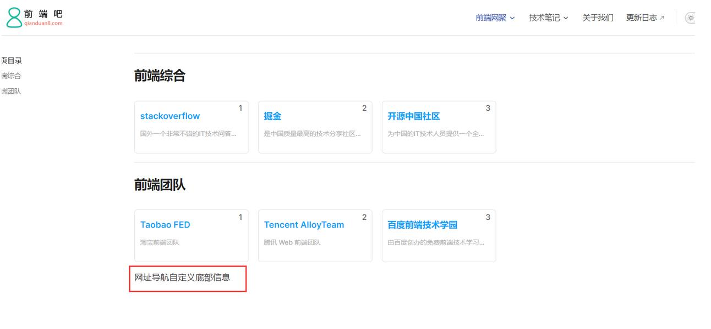

# 5、（进阶）如何自定义页面模板、给页面添加独有的className和使页面标题变成侧边目录？

> 本文参考：http://www.qianduan8.com/2048.html

上一节其实我们也简单说了自定义页面模板，这一节更加详细一点说明，开始之前我们要知道在vitePress中，.md的文件是可以直接编写vue的代码的。

比如我们现在来自定义一个前端网址导航页面
## 八、自定义一些页面模板

### 1、编写组件代码

想自定义页面模板样式，该如何做呢？
我们先在theme/components下新建siteList.vue文件，编写模板，代码如下：

```vue
<template>
  <!-- 网址分类模块 -->
  <section class="site-section">
      <!-- 标题 -->
    <h2 class="title">{{ props.title }}</h2>
    <!-- 网址列表 -->
    <ul class="list">
      <li class="item" v-for="(v, index) in props.data" :key="v.name">
        <a class="link" :href="v.link" target="_blank">
          <span class="num">{{ index + 1 }}</span>
          <h4 class="name">{{ v.name }}</h4>
          <p class="desc">{{ v.desc }}</p>
        </a>
      </li>
    </ul>
  </section>
</template>
<script setup>
const props = defineProps({
  title: String,
  data: {
    type: Array,
    default: [],
  },
});
  
</script>
<style lang="scss" scoped>
/*单行文本省略号*/
@mixin single-ellipsis {
  overflow: hidden;
  word-wrap: normal;
  white-space: nowrap;
  text-overflow: ellipsis;
}
.site-section {
  .title {
    color: #222;
  }
  .list {
    display: flex;
    flex-wrap: wrap;
    list-style: none;
    padding-left: 0;
    .item {
      width: 212px;
      margin: 15px 15px 0 0px;
      background: #fff;
      position: relative;
      .link {
        width: 210px;
        display: block;
        border: 1px solid #e3e3e3;
        padding-bottom: 8px;
        border-radius: 6px;
        .num {
          display: block;
          width: 24px;
          height: 18px;
          line-height: 18px;
          position: absolute;
          color: #666;
          font-size: 14px;
          text-align: center;
          right: 5px;
          top: 5px;
        }
        .name {
          width: 80%;
          height: 26px;
          padding-left: 10px;
          font-size: 16px;
          font-weight: 600;
          color: #06a4fa;
          margin-top: 15px;
          @include single-ellipsis;
        }
        .desc {
          font-size: 12px;
          margin: 10px 10px 0;
          color: #b1b1b1;
          height: 36px;
          line-height: 18px;
          @include single-ellipsis;
        }
        &:hover {
          text-decoration: none;
          border: 1px solid var(--vp-c-brand);
          filter: brightness(1.15);
          box-shadow: 0 15px 30px rgba(0, 0, 0, 0.1);
          transform: rotateY(-0.1deg) scale(1.001) translateZ(0);
          transition: all 0.24s ease;
          .name {
            color: var(--vp-c-brand);
          }
          .num {
            background: var(--vp-c-brand);
            color: #fff;
          }
        }
      }
    }
  }
}
</style>
```

### 2、注册组件

上面我们写好组件代码后，需注册为全局组件，如下theme/index.js的配置，把SiteList注册为全局组件，然后在页面引用即可。

```js
// https://vitepress.dev/guide/custom-theme
import { h } from "vue";
import siteList from "./components/siteList.vue";
  
import DefaultTheme from "vitepress/theme";
import "./styles/custom.scss";
import "./styles/site.scss";
import "./styles/rainbow.css";
  
export default {
  ...DefaultTheme,
  NotFound: () => "404", // <- this is a Vue 3 functional component
  enhanceApp({ app, router, siteData }) {
    // app is the Vue 3 app instance from createApp()
    // router is VitePress' custom router (see `lib/app/router.js`)
    // siteData is a ref of current site-level metadata.
    app.component("SiteList", siteList);
  },
};
```

### 3、如何给页面添加自定义类className

官方就有最简单的配置方法，向特定页面添加额外的类名pageClass：比如给page.md页面配置，只需如下即可
```md
---
pageClass: site-layout
---
```

然后在下面写样式即可
```md
.site-layout {
  ...
}
```

当然还有一种方法是：我们还可以在theme/index.js，通过js添加(Layout配置)，这个一个页面可以添加多个className了。
```
// https://vitepress.dev/guide/custom-theme
import { useData } from "vitepress";
import siteList from "./components/siteList.vue";
  
import DefaultTheme from "vitepress/theme";
import "./styles/custom.scss";
import "./styles/site.scss";
import "./styles/rainbow.css";
  
export default {
  ...DefaultTheme,
  NotFound: () => "404", // <- this is a Vue 3 functional component
  enhanceApp({ app, router, siteData }) {
    // app is the Vue 3 app instance from createApp()
    // router is VitePress' custom router (see `lib/app/router.js`)
    // siteData is a ref of current site-level metadata.
    // 注册全局组件
    app.component("SiteList", siteList);
  },
  // 自定义布局配置
  Layout: () => {
    const props = {};
    // 获取 frontmatter
    const { frontmatter } = useData();
  
    /* 添加自定义 class */
    if (frontmatter.value?.layoutClass) {
      props.class = frontmatter.value.layoutClass;
    }
  },
};
```

然后同样的page.md页面，我们可以通过layoutClass设置另一个className了，如下
```
---
layoutClass: site-page
pageClass: site-layout
---
```

### 4、页面使用组件

同样还是上面的page.md，我们使用组件如下
```
---
pageClass: site-layout
---
  
<SiteList v-for="model in siteData" :key="model.title" :title="model.title" :data="model.items" />
<script setup>
// 网址导航页面的数据
import siteData from "./data/page.js";
</script>
```

效果
::: details 查看图片

:::

### 5、如何使页面标题变成侧边目录呢？

从上面图中可以看出，我们发现右边没有侧边导航，那么如何使页面标题变成侧边目录呢？

这个时候需要用到@mdit-vue/shared，siteList.vue组件修改代码如下

**注意： a标签的class必须为** header-anchor 要不侧边栏没有激活状态
```
<a class="header-anchor" :href="`#${createTitle}`" aria-hidden="true"></a>
```
```
<template>
  <!-- 网址分类模块 -->
  <!-- <backTop></backTop> -->
  <section class="site-section">
    <!-- 瞄点标题 -->
    <h2 class="title" :id="createTitle">
      {{ props.title }}
      <a class="header-anchor" :href="`#${createTitle}`" aria-hidden="true"></a>
    </h2>
    <!-- 网址列表 -->
    <ul class="list">
      <li class="item" v-for="(v, index) in props.data" :key="v.name">
        <a class="link" :href="v.link" target="_blank">
          <span class="num">{{ index + 1 }}</span>
          <h4 class="name">{{ v.name }}</h4>
          <p class="desc">{{ v.desc }}</p>
        </a>
      </li>
    </ul>
  </section>
</template>
<script setup>
import { computed } from "vue";
import { slugify } from "@mdit-vue/shared";
const props = defineProps({
  title: String,
  data: {
    type: Array,
    default: [],
  },
});
  
// 生成侧边栏markdown的目录
const createTitle = computed(() => {
  return slugify(props.title);
});
</script>
```

发现目录已经有了，效果如下：
::: details 查看图片

:::

这个时候目录是在页面右边的，那么如何变成在左侧边栏呢？我们通过样式调整即可，site.scss
```
/**
  网址导航页面样式
**/
  
.site-layout {
  /*布局调整*/
  .VPDoc {
    .container {
      max-width: 100% !important;
      justify-content: flex-start !important;
      .aside {
        order: 1;
      }
      .content {
        order: 2;
        max-width: 100% !important;
        .content-container {
          max-width: 100% !important;
        }
      }
      .main {
        height: auto;
        overflow: hidden;
        .vp-doc h2 {
          margin: 0;
        }
      }
    }
  }
  /* 隐藏底部的在 github 上编辑此页模块*/
  .VPDocFooter {
    display: none;
  }
}
```

::: details 查看图片

:::

### 6、如何自定义页面的底部？

我们新建一个siteFooter.vue组件，然后在theme/index.js通过h函数配置即可，这里使用到doc-after插槽，

默认主题布局中可用插槽的完整列表：https://process1024.github.io/vitepress/guide/theme-introduction

```
<template>
  <div class="site-footer">
    网址导航自定义底部信息
  </div>
</template>
```

```
import { h } from "vue";
import siteFooter from "./components/siteFooter.vue";
  
import DefaultTheme from "vitepress/theme";
  
export default {
  ...DefaultTheme,
  NotFound: () => "404", // <- this is a Vue 3 functional component
  enhanceApp({ app, router, siteData }) {
    // app is the Vue 3 app instance from createApp()
    // router is VitePress' custom router (see `lib/app/router.js`)
    // siteData is a ref of current site-level metadata.
    // 注册全局组件
  },
  // 自定义布局配置
  Layout: () => {
    return h(DefaultTheme.Layout, props, {
      // 自定义文档底部，使用doc-after插槽
      "doc-after": () => h(siteFooter),
    });
  },
};
```

::: details 查看图片

:::

github项目地址：https://github.com/msyuan/vitePress-project  
在线预览效果：https://msyuan.github.io/vitePress-project