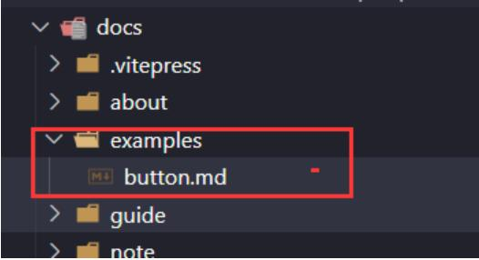
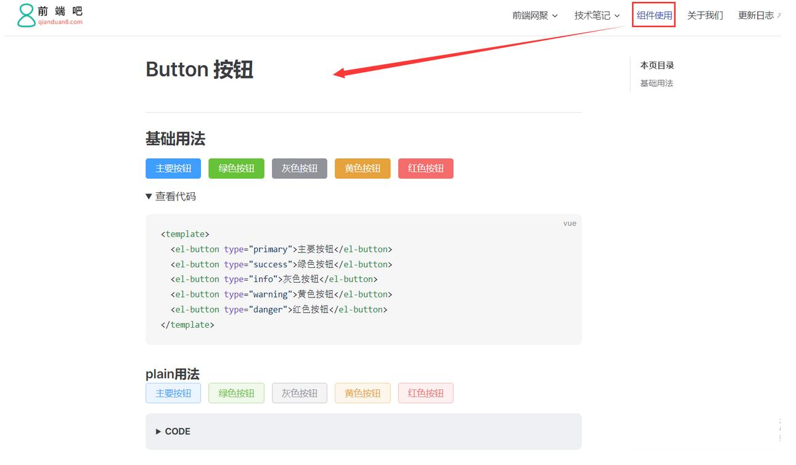

# 6、（进阶）第三方组件库的使用-搭建组件库文档

> 本文参考：http://www.qianduan8.com/2126.html

## 九、第三方组件库的使用

我们经常看见UI组件库的文档，这里我们就用element-plus第三方组件库为例子，搭建组件库文档

examples：作为组件库示例目录，我们以Button组件使用为例

::: details 查看图片

:::

### 1、安装element-plus

```
pnpm install element-plus
```

### 2、引入element-plus

安装完成后，在theme/index.js引入element-plus相关文件

```
import DefaultTheme from "vitepress/theme";
  
import ElementPlus from "element-plus";
import "element-plus/dist/index.css";
  
export default {
  ...DefaultTheme,
  NotFound: () => "404", // <- this is a Vue 3 functional component
  enhanceApp({ app, router, siteData }) {
    // app is the Vue 3 app instance from createApp()
    // router is VitePress' custom router (see `lib/app/router.js`)
    // siteData is a ref of current site-level metadata.
    app.use(ElementPlus);
  },
};
```

### 3、编写button.md文档
```
# Button 按钮
  
## 基础用法
  
<div class="ui-button">
  <el-button type="primary">主要按钮</el-button>
  <el-button type="success">绿色按钮</el-button>
  <el-button type="info">灰色按钮</el-button>
  <el-button type="warning">黄色按钮</el-button>
  <el-button type="danger">红色按钮</el-button>
</div>
  
<details>
  <summary>查看代码</summary>
  
``` vue
<template>
  <el-button type="primary">主要按钮</el-button>
  <el-button type="success">绿色按钮</el-button>
  <el-button type="info">灰色按钮</el-button>
  <el-button type="warning">黄色按钮</el-button>
  <el-button type="danger">红色按钮</el-button>
</template>
# ```（这里把这个#号去掉）
  
</details>
  
  
### plain用法
  
<div class="ui-button">
  <el-button type="primary" plain>主要按钮</el-button>
  <el-button type="success" plain>绿色按钮</el-button>
  <el-button type="info" plain>灰色按钮</el-button>
  <el-button type="warning" plain>黄色按钮</el-button>
  <el-button type="danger" plain>红色按钮</el-button>
</div>
  
::: details CODE
  
``` vue
<el-button type="primary" plain>主要按钮</el-button>
<el-button type="success" plain>绿色按钮</el-button>
<el-button type="info" plain>灰色按钮</el-button>
<el-button type="warning" plain>黄色按钮</el-button>
<el-button type="danger" plain>红色按钮</el-button>
# ```（这里把这个#号去掉）
:::
```

这里用到html5的**details和summary**标签，不了解的话可以去搜索看下。

然后配置一个“组件使用”的头部导航，效果如下：

::: details 查看图片

:::

在线预览效果：https://msyuan.github.io/vitePress-project/examples/button.html  
github地址：https://github.com/msyuan/vitePress-project 