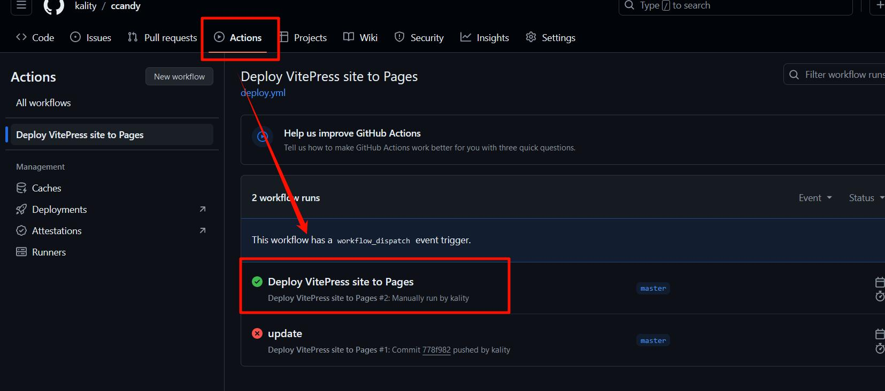

# 7、如何用Github Actions自动化部署到Github Pages？

> 本文参考：  
> https://juejin.cn/post/7361629576416739369  
> https://www.php.cn/faq/812001.html

我们搭建完成vitePress后，那么接下来就是如何部署到线上服务器，这里使用Github Pages，免得自己购买服务器，当然你也可以自己购买服务器来部署（比如阿里云服务器）。

## 一、项目准备

参照 Vitepress 官网的部署指南，我们应该认真核对以下注意事项：

1. VitePress 项目应该位于 `docs` 目录中
2. 使用的是默认的生成输出目录 `.vitepress/dist`
3. VitePress 作为本地依赖项安装在项目中，并且在 `package.json` 文件中应该至少包含以下脚本（也就是至少要有docs:build和docs:preview或者类似的）
```js
{
  "scripts": {
    "docs:build": "vitepress build docs",
    "docs:preview": "vitepress preview docs"
  }
}
```

## 二、本地文件配置与Github仓库的准备

### 1、编写Github Action自动化文件yml

在项目根目录创建 .github 文件夹，然后在其中创建 workflows 目录，新建 deploy.yml 文件。


文件中应包含以下内容：
```yml
# 构建 VitePress 站点并将其部署到 GitHub Pages 的示例工作流程
name: Deploy VitePress site to Pages

on:
  # 在针对 `main` 分支的推送上运行
  # 如果是使用 `master` 分支作为默认分支，请将其更改为 `master`
  push:
    branches: [master]

  # 允许你从 Actions 选项卡手动运行此工作流程
  workflow_dispatch:

# 设置 GITHUB_TOKEN 的权限，以允许部署到 GitHub Pages
permissions:
  contents: read
  pages: write
  id-token: write

# 只允许同时进行一次部署，跳过正在运行和最新队列之间的运行队列
# 但是，不要取消正在进行的运行，因为我们希望允许这些生产部署完成
concurrency:
  group: pages
  cancel-in-progress: false

jobs:
  # 构建工作
  build:
    runs-on: ubuntu-latest
    steps:
      - name: Checkout
        uses: actions/checkout@v4
        with:
          fetch-depth: 0 # 如果未启用 lastUpdated，则不需要
      # - uses: pnpm/action-setup@v3 # 如果使用 pnpm，请取消注释
      # - uses: oven-sh/setup-bun@v1 # 如果使用 Bun，请取消注释
      - name: Setup Node
        uses: actions/setup-node@v4
        with:
          node-version: 20
          cache: npm # 或 pnpm / yarn
      - name: Setup Pages
        uses: actions/configure-pages@v4
      - name: Install dependencies
        run: npm ci # 或 pnpm install / yarn install / bun install
      - name: Build with VitePress
        run: npm run docs:build # 或 pnpm docs:build / yarn docs:build / bun run docs:build // [!code warning]
      - name: Upload artifact
        uses: actions/upload-pages-artifact@v3
        with:
          path: docs/.vitepress/dist

  # 部署工作
  deploy:
    environment:
      name: github-pages
      url: ${{ steps.deployment.outputs.page_url }}
    needs: build
    runs-on: ubuntu-latest
    name: Deploy
    steps:
      - name: Deploy to GitHub Pages
        id: deployment
        uses: actions/deploy-pages@v4
```
**注意第46行处的bulid应该和package.json处的一样**

### 2、Github仓库的配置

新建一个仓库，然后进入到 GitHub 中的 **Settings** 页面，点击左侧的 **Pages** 菜单，在 **Build and deployment** 标题下，选择 **Source** 为 **GitHub Actions**。


## 三、Git的使用与部署推送

### 1、git的下载，同时与自己的github账号通过ssh连接

### 2、git的使用与部署

**步骤 1：创建本地仓库**

在项目文件夹处打开git，同时初始化，创建一个本地仓库，**这将创建一个名为 .git 的文件夹，用于跟踪项目的版本历史。**
```
git init
```


**步骤 2：创建远程仓库**

打开  GitHub 的那个新建的仓库

记下仓库的 URL，通常以 https:// 或 git@ 开头。（也就是远程仓库的URL）


**步骤 3：添加远程仓库**

回到本地仓库目录，运行以下命令：
```
git remote add origin [远程仓库的URL] 
```

origin 是远程仓库的名称，你可以使用任何你喜欢的名称。

验证关联是否成功：使用命令 git remote -v 查看远程仓库的关联情况，如果成功关联，会显示远程仓库的URL。

**步骤 4：推送到远程仓库**

在本地仓库中，将你的`更改暂存`。
```
git add .
```
然后`提交你的更改`。
```
git commit -m "UpdateMessage"
```
最后，将你的提交`推送到远程仓库`。
```
git push origin master
```
`master` 是远程仓库中的默认分支。

**步骤 5：从远程仓库拉取**

在本地仓库中，运行以下命令从远程仓库拉取更改：
```
git pull origin master
```
这将更新你的本地副本，并合并远程更改。

::: tip
**小提示：git的一些其他常用命令**

1、检查分支
```
git branch
```

2、切换到目标分支（假设目标分支是mybranch）
```
git checkout mybranch
```

3、创建新的本地分支
创建一个新的本地分支（例如“temp”），并检出该分支。
```
git checkout -b temp
```
成功后会显示`Switched to a new branch 'temp'`

4、清空分支内容

执行以下命令，将分支的内容清空，保留空的分支结构：
```
git rm -r .
```
这将清空目标分支下的所有文件和文件夹。需要注意的是，该命令会将分支下的所有文件都删除，所以在执行前，请确保你确实想要清空分支内容。

5、将主分支重命名为“master”
```
git branch -m master
```

6、将其他分支合并到当前分支上（temp被合并后就消失了）
```
git merge temp
```

7、提交推送到远程仓库的区别

第一次要使用`git pull -u origin master`，第二次可以直接用`git pull origin master`（也就是不用加`-u`）
:::

### 3、查看是否部署成功，以及部署后的网址




## 四、打开网页格式错乱的调整