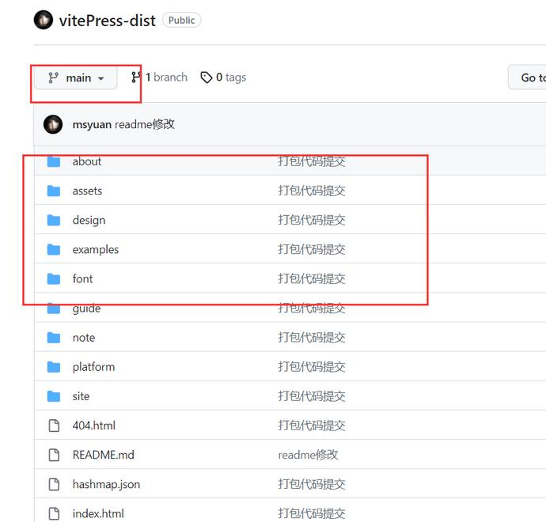
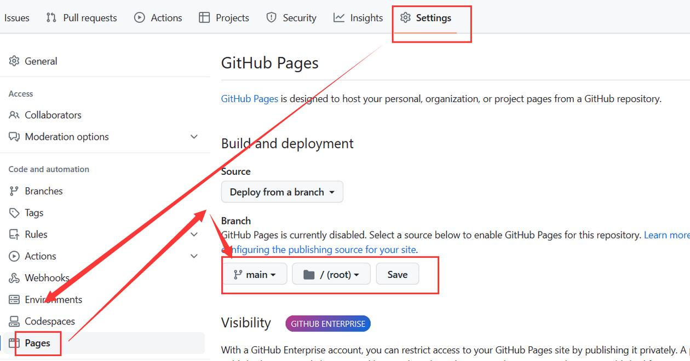

# 8、vitePress如何非自动化部署到Github Pages？

> 本文参考：http://www.qianduan8.com/2097.html

上一节我们讲到用Github Actions自动化部署到Github Pages，其实我们也可以直接把打包后的代码部署到Gtihub Pages的，那如何做呢？

其实大同小异，只是少了Github Actions的相关配置流程而已。最简单的方式如下

## 1、在Github上新建一个仓库

在Github上新建一个仓库，我们就叫**vitePress-dist**吧

然后在自己电脑的项目进行打包pnpm build，提交打包后的代码到vitePress-dist仓库 

::: details 查看图片

:::

## 2、配置Github Pages

同样的配置Pages，到vitePress-dist仓库 -> Settings -> Pages 

::: details 查看图片

:::

选择分支main和root目录即可。

然后再次进入**Settings -> Pages**会看到博客链接地址，直接访问即可

github项目地址：https://github.com/msyuan/vitePress-project  
在线预览效果：https://msyuan.github.io/vitePress-project