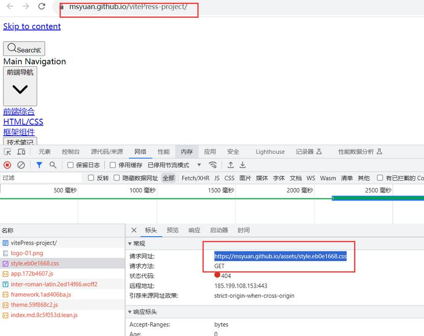

# 9、VitePress部署到Github Pages后发现样式全错乱了怎么办？

> 本文参考：http://www.qianduan8.com/2099.html

当我们部署到Github pages线上后，发现全是样式错乱的，也就是无样式，怎么办？在此简单记录一下

这个时候我们作为前端开发者，可以打开浏览器调试看看就发现了，是静态资源地址不对，如下 

::: details 查看图片

:::

这个时候，我们只需修改theme/config.js中的基本路径即可，因为我们的访问地址是https://msyuan.github.io/vitePress-project/ 这样的，所以配置修改成如下即可

```
export default {
  base: "/vitePress-project/",
}
```

再次发布就OK了。

github项目地址：https://github.com/msyuan/vitePress-project  
在线预览效果：https://msyuan.github.io/vitePress-project
